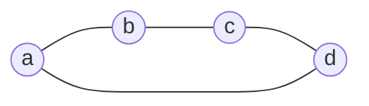

In the previous notes, we used graph vectors, quadratic forms, inner products, and Gram determinants without introducing a separate language for describing them together.

The need for such a language became especially clear in [[Joint Variation of Multiple Links]]. The mixed coefficient arising from simultaneous variation of several conductances turned out to be the Gram determinant of the corresponding graph vectors. Geometrically, the same determinant gives the squared area, volume, or higher-dimensional analogue, as shown in [[From Lengths to Areas and Volumes]].

We now introduce a minimal algebraic construction that allows us to work with these objects directly.

This construction is not yet a metric theory by itself. We first define the objects and operations of **polyform algebra**. The metric structure will appear later, when this language is applied to the graph Laplacian.

## Three levels of the construction

It is useful to separate three levels from the outset.

1. **Ordinary linear and exterior algebra.** This includes linear combinations, exterior products, simplices, the boundary operator, bilinear and quadratic forms, Gram matrices, and Gram determinants.
2. **The way these objects are used in polyform algebra.** Arguments of forms may be not only individual vectors but also exterior products of objects of different grades. Products of forms are defined through exterior products of their arguments.
3. **Project-specific conventions.** These include the term "polyform", the unit form $e$, the adopted notation for boundaries and grade components, and later the special metric constructions.

> [!remark] Terminology
> The terms **vector**, **simplex**, **boundary**, **exterior product**, **bilinear form**, **quadratic form**, and **Gram determinant** are standard mathematical terms.
>
> The term **polyform** is also used in other areas of mathematics, but here it has a specific meaning: a polyform is a linear combination of forms, possibly of different grades. This meaning should therefore be stated explicitly at first use.

## Points and vectors

Let $a,b,c,\ldots$ denote basic points of the space. In the graph interpretation, they are graph vertices. For algebraic operations, we treat these points as formal generators of a linear space. This does not identify a point with a vector in the affine sense: the distinction between them is determined by the coefficients of a linear combination.

The difference of two points defines a vector $(ab)=b-a$.

Round brackets are the adopted notation for the boundary of a pair of points. Orientation matters: $(ba)=-(ab)$.

More generally, a vector is a linear combination of points whose coefficients sum to zero. If $v=\sum_i \lambda_i a_i$, then the condition that $v$ is a vector is $\sum_i\lambda_i=0$.

For example, $v=a+b-2c$ is a vector.

An affine combination whose coefficients sum to $1$ defines a point again. For example, $(a+b)/2$ is the midpoint of $a$ and $b$.

This distinction is sufficient for the introductory algebra. A more specialized description in terms of affine weight and isotropic extension is not needed here.

## Exterior product and simplices

The exterior product is denoted by the standard symbol $\wedge$. For basic objects it is anticommutative: $a\wedge b=-b\wedge a$, and therefore $a\wedge a=0$.

The exterior product of several elements will be written as an oriented simplex $[a_1\ldots a_k]=a_1\wedge\cdots\wedge a_k$.

The **grade** of a simplex is the number of its factors. Thus a point has grade $1$, $[ab]$ has grade $2$, and $[abc]$ has grade $3$.

This convention differs by one from the standard geometric dimension of a simplex: $[abc]$ has grade $3$ but is a two-dimensional simplex.

Interchanging two neighboring elements changes the sign of the simplex. If an element is repeated, the simplex is zero.

For homogeneous exterior objects $X$ and $Y$ of grades $k$ and $m$, we have $X\wedge Y=(-1)^{km}Y\wedge X$, while the grade of the product is $k+m$.

> [!definition] Family
> In this note, a **family** is a finite ordered family of objects intended to be combined by the exterior product.
>
> A family is not a new algebraic object. It only records the factors and their order. The exterior object itself is the result of their product.

This distinction is useful because permuting the same family may change the sign, while a family containing a repeated element has zero exterior product.

## Boundary

For simplices we use the standard boundary operator $\partial$. For a simplex $[a_1\ldots a_k]$, its boundary is the alternating sum of simplices obtained by deleting one element:

$$
\partial[a_1\ldots a_k] = \sum_{i=1}^k(-1)^{i-1}[a_1\ldots\widehat{a_i}\ldots a_k]
$$

We denote boundaries by round brackets. In particular, $(ab)=\partial[ab]=b-a$, while $(abc)=\partial[abc]=[bc]-[ac]+[ab]$.

The grade of a boundary is one less than the grade of the original simplex. Thus the vector $(ab)$ has grade $1$, while the boundary of a triangle $(abc)$ has grade $2$.

The fundamental standard property of the boundary operator is $\partial^2=0$.

The boundary operator is compatible with the exterior product through the graded Leibniz rule. If $X$ has grade $k$, then
$$
\partial(X\wedge Y)
=
\partial X\wedge Y+(-1)^kX\wedge\partial Y
$$

## Products of boundaries and connectedness

Boundaries can be multiplied using the exterior product. For the simplest graph boundaries, $(ab)(bc)=(abc)$.

Here and below, the symbol $\wedge$ between boundaries is sometimes omitted when this causes no ambiguity.

If two connected boundaries have exactly one common point, their product merges into a single connected boundary. If they have two or more common points, the product is zero. If they have no common points, the components remain separate.

The simplest examples are $(abc)(bc)=0$, $(ab)(bc)=(abc)$, and $(ab)(cd)=(ab)(cd)$.

> [!definition] Connected family of boundaries
> A family of boundaries $B_1,\ldots,B_m$ is called **connected** if it cannot be split into two nonempty groups such that boundaries from different groups have no common basic points.
>
> For a family of graph vectors $(a_ib_i)$, this agrees with the usual graph connectedness of the corresponding edge system after unused vertices are removed.

Connectedness of a family does not by itself guarantee a nonzero exterior product. For example, the family of three sides of a triangle is connected, but the corresponding vectors are linearly dependent, so $(ab)\wedge(bc)\wedge(ca)=0$.

If a connected family of graph vectors contains no such dependence, its product gives one boundary component. A disconnected family gives a product of several components.

### Boundaries as a closed class

For later applications, an important fact is that exterior multiplication of boundaries does not take us outside the class of boundaries.

Let $B_1=\partial X$ and $B_2=\partial Y$. Since $\partial B_2=0$, the Leibniz rule gives
$$
B_1\wedge B_2
=
\partial X\wedge B_2
=
\partial(X\wedge B_2)
$$
Therefore, the exterior product of two boundaries is again a boundary.

This allows boundary objects to be treated as an independent graded subalgebra of the exterior construction.

> [!remark] A more precise algebraic statement
> If $\mathcal Z=\ker\partial$ is the cycle space and $\mathcal B=\operatorname{im}\partial$ is the boundary space, then $\mathcal B\subseteq\mathcal Z$, and $\mathcal B$ is a graded ideal in $\mathcal Z$.
>
> In general, $\mathcal B$ is not an ideal of the entire exterior algebra. This refinement will not be needed below.

This closure is precisely what makes boundaries natural arguments for the graph-related part of polyform algebra.

## Bilinear and quadratic forms

In standard linear algebra, a bilinear form is linear in each of its two arguments. In polyform algebra, we use the formal notation $[X,Y]$, where $X$ and $Y$ are exterior objects of the same grade.

A quadratic form is defined by $[X]^2=[X,X]$.

For example:

- $[a]^2$ is the form of a point;
- $[(ab)]^2$ is the quadratic form of a graph vector;
- $[(abc)]^2$ is the quadratic form of a second-grade boundary.

It is important to distinguish the **formal algebraic object** from its later **numerical metric evaluation**. The expression $[X]^2$ does not by itself denote a specific number. Once a metric is specified, such a form may be evaluated as the squared norm of the corresponding object.

For an undirected graph edge, the quadratic form does not depend on the chosen orientation, because $[(ba)]^2=[-(ab)]^2=[(ab)]^2$.

This is one reason why quadratic forms are particularly convenient for representing undirected links.

## Polyforms and grades

> [!definition] Polyform
> In this series, a **polyform** is a linear combination of forms. Its terms may have the same grade or different grades.

If all terms have the same grade, the polyform is called **homogeneous**. An arbitrary polyform can be decomposed by grade as $P=P_0+P_1+P_2+\cdots$, where $P_k$ is the homogeneous component of grade $k$.

In this project, such a component may also be called a **grade component** or **grade polyform**.

The grade of a form is defined by the grade of its arguments. For example, $[(ab)]^2$ has grade $1$, while $[(abc)]^2$ has grade $2$.

We also introduce the **unit form** $e$ of grade $0$. It is the neutral element for multiplication of forms: $eF=Fe=F$.

## Product of forms

The key operation of polyform algebra is defined through the exterior product of arguments.

Let $[X,Y]$ and $[A,B]$ be bilinear forms. Define
$$
[X,Y][A,B]=[X\wedge A,Y\wedge B]\tag{1}
$$
For quadratic forms, this gives the particularly simple rule
$$
[X]^2[A]^2=[X\wedge A]^2\tag{2}
$$
If $X$ has grade $k$ and $A$ has grade $m$, then their product has grade $k+m$.

Thus, the product of two first-grade quadratic forms is already a second-grade form. For example, $[(ab)]^2[(bc)]^2=[(abc)]^2$.

The algebraic meaning of the grade increase is direct: separate vectors are combined by the exterior product into a higher-grade object.

### Why forms commute

Exterior objects do not commute in general. If the grades of $X$ and $A$ are $k$ and $m$, then $X\wedge A=(-1)^{km}A\wedge X$.

But in a bilinear form, interchanging the factors produces the same sign simultaneously in both arguments. The two signs therefore cancel: $[X,Y][A,B]=[A,B][X,Y]$.

Hence the multiplication of forms defined above is commutative, even though it is based on the anticommutative exterior product.

This property concerns multiplication of forms specifically and must not be confused with ordinary matrix multiplication.

## Nilpotency and repeated vectors

Exterior algebra immediately gives another important property. For any vector $v$, we have $v\wedge v=0$. Therefore, for the quadratic form $q_v=[v]^2$, we obtain $q_v^2=[v\wedge v]^2=0$.

More generally, if the same vector occurs repeatedly among the exterior arguments of a product, the corresponding product of forms is zero.

For example, for the graph vectors of a triangle, $(ab)+(bc)+(ca)=0$, so they are linearly dependent and $[(ab)]^2[(bc)]^2[(ca)]^2=0$.

Thus the algebra automatically eliminates families of vectors that do not span a nondegenerate exterior volume.

Later, this property will be the reason why forest-like sets of links survive in the Laplacian exponential while cyclic sets disappear.

## Product of forms and the Gram determinant

The connection with geometry appears once an inner product is specified.

Let $u_1,\ldots,u_k$ be vectors in a Euclidean space. The standard inner product induces an inner product on the exterior power such that
$$
\left\|u_1\wedge\cdots\wedge u_k\right\|^2
=
\det G(u_1,\ldots,u_k)
\tag{3}
$$
where $G(u_1,\ldots,u_k)$ is the Gram matrix.

On the other hand, in polyform algebra
$$
[u_1]^2\cdots[u_k]^2
=
[u_1\wedge\cdots\wedge u_k]^2
\tag{4}
$$
Therefore, **the metric evaluation of a product of first-grade quadratic forms equals the Gram determinant of their arguments**.

For two vectors, this is the squared area of the corresponding parallelogram. For three vectors, it is the squared volume of the parallelepiped. For $k$ vectors, it is the squared corresponding $k$-dimensional volume.

This is the same object that already appeared in [[From Lengths to Areas and Volumes]]. There the Gram determinant was introduced as a numerical geometric characteristic. We can now see the formal algebraic object behind it: $[u_1]^2\cdots[u_k]^2$.

For graph vectors $v_1,\ldots,v_k$, the metric evaluation of the form $[v_1]^2\cdots[v_k]^2$ equals $\det(\langle v_i,v_j\rangle)$. We do not introduce a new operator for this evaluation here.

> [!remark] Relation to joint variations
> In [[Joint Variation of Multiple Links]], the Gram determinant of selected graph vectors appeared as the mixed coefficient of their joint variation.
>
> Formula (4) shows that this coefficient naturally corresponds to the product of the quadratic forms of the selected links. This is precisely why multiplication of forms is an appropriate language for describing variations of several links simultaneously.

## Boundary subalgebra and graphs

General polyform algebra allows forms on arbitrary exterior objects. They need not be boundaries and need not have a graph interpretation at all.

When we pass to graphs, a narrower class is selected: the arguments of the elementary forms are graph vectors $(ij)=a_j-a_i$, that is, first-grade boundaries.

Because the product of boundaries is again a boundary, all products of such forms remain inside the same class. Graph polyforms therefore naturally live in the **subalgebra of forms on boundaries**.

The sequence of specializations can be written schematically as
$$
\text{exterior algebra of objects}
\longrightarrow
\text{polyform algebra}
\longrightarrow
\text{polyforms on boundaries}
\longrightarrow
\text{graph polyforms}
$$

The last step already uses the special structure of a graph but does not yet require a metric interpretation.

## Polyform representation of the Laplacian

So far, the definitions have been intentionally abstract. We now apply them to a concrete graph.

Consider the simple cycle $C_4$ with four vertices $a,b,c,d$ and unit conductances.

When the representation of an object is clear from context, we use its ordinary symbol. Thus the Laplacian polyform is denoted simply by $L$. If the matrix representation is needed in the same discussion, we distinguish the matrix typographically as $\mathbf L$.

For the cycle $C_4$, the matrix Laplacian is
$$
\mathbf L=
\begin{array}{c|rrrr}
 & a & b & c & d\\
\hline
a & 2 & -1 & 0 & -1\\
b & -1 & 2 & -1 & 0\\
c & 0 & -1 & 2 & -1\\
d & -1 & 0 & -1 & 2
\end{array}
$$
The row and column headings make explicit that the matrix is indexed by graph vertices. Diagonal entries belong to the vertices themselves and equal their degrees, while off-diagonal entries describe links between the corresponding pairs of vertices.

The same graph can be written in polyform algebra. Associate with each edge its graph vector: $(ab)$, $(bc)$, $(cd)$, and $(da)$. The quadratic form of each such vector represents one link. Therefore, the polyform representation of the Laplacian is
$$
L=[(ab)]^2+[(bc)]^2+[(cd)]^2+[(da)]^2\tag{5}
$$
In later polyform formulas, this is the representation meant by the symbol $L$ unless stated otherwise.

The meaning of multiplication is now visible directly on the graph. Two adjacent links give a second-grade form: $[(ab)]^2[(bc)]^2=[(abc)]^2$. Two nonadjacent links give a two-component boundary: $[(ab)]^2[(cd)]^2=[(ab)(cd)]^2$.

The product of three consecutive edges of the cycle gives one third-grade boundary: $[(ab)]^2[(bc)]^2[(cd)]^2=[(abcd)]^2$. But the product of all four edges is zero because the cycle vectors are linearly dependent: $(ab)+(bc)+(cd)+(da)=0$.

Thus, already for $C_4$, we can see that a polyform is not another notation for matrix multiplication. It stores links as quadratic forms of graph vectors, while multiplication combines them into joint boundary objects of higher grade.

For an arbitrary weighted graph, the Laplacian polyform is
$$
L=\sum_{i<j}c_{ij}[(ij)]^2\tag{6}
$$
Each term has grade $1$, so $L$ is a homogeneous quadratic polyform of first grade.

Its square already contains second-grade forms. If $q_e=[v_e]^2$, then $L^2=\sum_{e,f}c_ec_fq_eq_f$.

Terms with $e=f$ disappear because $q_e^2=0$, while linearly dependent sets of links likewise give zero exterior product.

Thus ordinary powers of the Laplacian polyform automatically construct objects of progressively higher grades while simultaneously discarding degenerate sets of links.

> [!warning] Matrix and polyform
> The Laplacian polyform $L$ and the matrix Laplacian $\mathbf L$ encode the same coupling coefficients but belong to different algebraic representations and are multiplied by different rules.
>
> Therefore, the polyform power $L^2$ and the matrix power $\mathbf L^2$ are different objects.

## Why the exponential comes next

It is now natural to look for a single object that contains all grades generated by the Laplacian polyform: $e$, $L$, $L^2$, $L^3$, $\ldots$

The standard way to collect all powers of one element into a single graded construction is the exponential $\exp L$.

In an ordinary algebra, this would be an infinite power series. Here, exterior nilpotency makes it finite: sufficiently high grades necessarily vanish.

Moreover, if $q_e=[v_e]^2$, then each elementary term $c_eq_e$ satisfies $(c_eq_e)^2=0$. Its exponential therefore has only two terms: $\exp(c_eq_e)=e+c_eq_e$.

This already prepares the factorized representation of the full Laplacian exponential. Its grade structure, relation to spanning forests, and metric meaning will be the subject of the next note [[Laplacian Exponential]].

## What we obtained

Polyform algebra separates formal operations from their metric interpretation.

The initial objects are points and their linear combinations. The exterior product creates simplices and higher-grade objects, the boundary operator selects a special closed class of boundary objects, and bilinear and quadratic forms allow us to build forms on these objects.

The key operation is defined by rule (1): the product of forms is the form of the exterior products of their arguments. From this follow the increase of grade, commutativity of form multiplication, and nilpotency caused by repeated vectors.

Once a metric is specified, the product of quadratic forms receives a numerical evaluation through the Gram determinant. Thus areas, volumes, and mixed coefficients of joint variations become different interpretations of the same algebraic construction.

Applying this algebra to the Laplacian polyform prepares the next step - passing to its exponential and to the metric construction of Polyform Metric Geometry itself.
