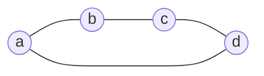

In [[Varying several couplings together|joint variations of couplings]], mixed coefficients are expressed by Gram determinants of several affine vectors. Polyform algebra associates a single formal object with such a system of vectors and allows operations on it before a numerical metric is specified.

The construction is based on exterior algebra. Forms and their product are introduced by separate definitions, which require no inner product. The connection with the resistance metric is discussed at the end of this note and developed in the next.

## Points and affine vectors

Let $V$ be a real vector space with a **linearly independent** basis $a_1,\ldots,a_n$. The basis elements represent vertices. For linear combinations, we distinguish points from affine vectors by the sum of their coefficients.

> [!info] Points and vectors
> **Definition.** A combination $x=\sum_i x_i a_i$ is a point if $\sum_i x_i=1$, and an affine vector if $\sum_i x_i=0$.
>
> Denote the space of affine vectors by
>
> $$
> W=\left\{\sum_i u_i a_i:\sum_i u_i=0\right\},\qquad \dim W=n-1
> $$

For example, $(a+b)/2$ is a point, while $a+b-2c$ is an affine vector. The difference of two points belongs to $W$. We retain the notation

$$
a_{ij}=a_j-a_i
$$

The formal basis points in $V$ are not identified with the centered position vectors of the preceding notes. There, centering specified Euclidean coordinates; here, linear independence of the base vertices is part of the underlying algebraic construction.

## The exterior product and grade

The exterior product $\wedge$ is bilinear and associative. For elements $x,y\in V$, it satisfies

$$
x\wedge y=-y\wedge x,\qquad x\wedge x=0
$$

> [!info] Exterior objects
> **Definition.** Linear combinations of products $x_1\wedge\cdots\wedge x_k$ form the space $\Lambda^kV$. Its elements are called exterior objects of grade $k$.
>
> The scalar $1$ has grade $0$ and is the identity for the exterior product. The product of objects of grades $k$ and $m$ has grade $k+m$ if it is nonzero.

For homogeneous objects,

$$
X\wedge Y=(-1)^{km}Y\wedge X
$$

The exterior product of $k$ elements of grade one vanishes if and only if those elements are linearly dependent.

An oriented simplex is written as

$$
[a_1\ldots a_k]=a_1\wedge\cdots\wedge a_k
$$

Its grade equals the number of vertices. Thus $[abc]$ has grade $3$, although a geometric triangle is two-dimensional. Interchanging two vertices changes the sign; repeating a vertex gives zero. A general exterior object may be a linear combination of simplices and need not be a single exterior product.

## The boundary operator

> [!info] The boundary
> **Definition.** The linear boundary operator is specified by
>
> $$
> \partial1=0,\qquad \partial a_i=1
> $$
>
> and, for $k\ge1$, by the rule
>
> $$
> \partial[a_1\ldots a_k]=\sum_{i=1}^k(-1)^{i-1}[a_1\ldots\widehat{a_i}\ldots a_k]
> \tag{1}
> $$
>
> The hat over $a_i$ indicates omission of that element; the empty exterior product is $1$. A nonzero boundary has grade one less than the original object.

The equality $\partial a_i=1$ is part of the definition: its right-hand side is a scalar of grade $0$, not an additional vertex. By linearity,

$$
\partial\left(\sum_i x_i a_i\right)=\sum_i x_i
$$

Thus the boundary of an affine vector is zero, and the boundary of a point is one.

We denote simplex boundaries by parentheses:

$$
(ab)=\partial[ab]=b-a,\qquad
(abc)=\partial[abc]=[bc]-[ac]+[ab]
$$

In particular, $(a_i a_j)=a_{ij}$. The abbreviated index notation $(ij)$ also means $a_{ij}$. The simplex $[abc]$ and its boundary $(abc)$ are distinct objects of grades $3$ and $2$.

> [!info] Properties of the boundary
> **Lemma.** For homogeneous $X$ of grade $k$,
>
> $$
> \partial^2=0,\qquad
> \partial(X\wedge Y)=\partial X\wedge Y+(-1)^kX\wedge\partial Y
> \tag{2}
> $$

For the first equality, each deletion of two vertices in (1) occurs twice with opposite signs. For the second, the terms separate into deletions from $X$ and from $Y$; a deletion from $Y$ is preceded by the $k$ factors of $X$. Both properties then follow by linearity.

## Boundaries and exterior powers of affine vectors

> [!info] The space of boundaries
> **Lemma.** At each grade $k$, the space of boundaries equals $\Lambda^kW$. Equivalently, for $B\in\Lambda^kV$, the following conditions are equivalent: $B$ is a boundary, $\partial B=0$, and $B\in\Lambda^kW$.

> [!note]- Proof
> **Proof.** Fix the base point $a_1$. It complements $W$ in $V$, so every object $B$ of grade $k\ge1$ has a unique representation
>
> $$
> B=D+a_1\wedge C,\qquad
> D\in\Lambda^kW,\quad C\in\Lambda^{k-1}W
> $$
>
> Every vector in $W$ has zero boundary. By (2), $\partial D=\partial C=0$ and $\partial B=C$. Hence $\partial B=0$ is equivalent to $B\in\Lambda^kW$.
>
> For such a $B$, we have $\partial(a_1\wedge B)=B$, so $B$ is a boundary. Conversely, a boundary satisfies $\partial B=0$ because $\partial^2=0$. For $k=0$, every scalar $s$ equals $\partial(sa_1)$, completing the proof. $\square$

Thus boundaries form a subalgebra of the exterior algebra: a product of boundaries is again a boundary. Nonzero boundaries have grades from $0$ to $n-1$. This bound follows from $\dim W=n-1$.

## Products of simplex boundaries

For base vertices $p,a_1,\ldots,a_r$, formula (1) gives

$$
(pa_1\ldots a_r)=(a_1-p)\wedge\cdots\wedge(a_r-p)
\tag{3}
$$

Consider the boundaries of two simplices on base vertices, each containing at least two vertices. If their only common vertex $p$ is placed first in both lists, then (3) gives

$$
(pa_1\ldots a_r)\wedge(pb_1\ldots b_s)=(pa_1\ldots a_r b_1\ldots b_s)
$$

Other vertex orders introduce the signs of the corresponding permutations. If there are at least two common vertices, the product is zero: choosing one common vertex as $p$, both products in (3) contain the difference between the second common vertex and $p$. If the vertex sets are disjoint, the product is nonzero and remains a product of two boundaries.

These rules apply specifically to boundaries of simplices on base vertices. For arbitrary linear combinations, the product is computed by bilinearity, rather than from the list of vertices appearing in the expression.

> [!example] Products of boundaries
>
> $$
> (ab)\wedge(bc)=(b-a)\wedge(c-b)=[bc]-[ac]+[ab]=(abc)
> $$
>
> $$
> (abc)\wedge(bc)=0,\qquad
> (ab)\wedge(cd)=[bd]-[bc]-[ad]+[ac]
> $$

From now on, the symbol $\wedge$ between exterior objects may be omitted when the operation is unambiguous: for example, $(ab)(bc)=(abc)$.

> [!info] Products of edge vectors
> **Theorem.** The exterior product of the vectors of selected edges is nonzero if and only if those edges form a forest. For a tree on vertices $a_{i_1},\ldots,a_{i_s}$, the product equals $\pm(a_{i_1}\ldots a_{i_s})$. For a forest, it is the product of the boundaries of its components, up to an orientation sign.

> [!note]- Proof
> **Proof.** The edge vectors of a cycle are linearly dependent: after their directions are aligned around the cycle, their sum is zero. Thus a cycle makes the entire product vanish, even in the presence of other components.
>
> In a forest, the edge vectors are independent. In any linear dependence, the coefficient of a leaf vertex forces the coefficient of its only incident edge to be zero. Successive removal of leaves makes all coefficients of the dependence zero.
>
> For a tree, applying the rule for merging at one common vertex as leaves are successively attached gives the boundary of the whole tree, up to sign. For a forest, this is done in each component. An isolated vertex contributes the factor $\partial a_i=1$. $\square$

## Forms: bilinearity and basic operations

> [!info] Forms of a fixed grade
> **Definition.** For $X,Y\in\Lambda^kV$, introduce formal symbols $[X,Y]$. They generate the vector space of forms of grade $k$, subject only to the bilinearity relations
>
> $$
> [\alpha X+\beta Z,Y]=\alpha[X,Y]+\beta[Z,Y]
> $$
>
> $$
> [X,\alpha Y+\beta Z]=\alpha[X,Y]+\beta[X,Z]
> $$
>
> In each formula, all arguments have grade $k$, and $\alpha,\beta\in\mathbb R$. Symmetry $[X,Y]=[Y,X]$ is not assumed.

This definition specifies a formal object, rather than a number or a scalar-valued bilinear function on $V$. If $E_1,\ldots,E_N$ form a basis of $\Lambda^kV$, then the forms $[E_i,E_j]$ form a basis of the space of forms of that grade.

> [!info] Quadratic forms, transposition, and polar forms
> **Definition.** For arguments of the same grade, set
>
> $$
> [X]^2=[X,X],\qquad [X,Y]^{\mathsf T}=[Y,X]
> $$
>
> $$
> \{X,Y\}=[X,Y]+[Y,X]
> $$
>
> Transposition extends to linear combinations. The polar form is defined without a factor of $1/2$.

Bilinearity gives

$$
[X+Y]^2=[X]^2+\{X,Y\}+[Y]^2
$$

For example, $[a]^2$ is a form of a point, $[(ab)]^2$ is a form of an affine vector, and $[(abc)]^2$ is a form of a boundary of grade two. Reversing the orientation of the argument leaves the quadratic form unchanged: $[-X]^2=[X]^2$.

The notation $[X]^2$ denotes a form. It means neither the exterior product $X\wedge X$ nor a numerical squared norm. Numerical metric quantities will be defined separately.

## The four-point identity

> [!info] The polar-form identity
> **Lemma.** For any four points $a_i,a_j,a_k,a_l$ and their affine differences $a_{ij}=a_j-a_i$, the following identity of forms holds:
>
> $$
> \{a_{ij},a_{kl}\}+\{a_{jk},a_{il}\}+\{a_{ik},a_{lj}\}=0
> \tag{4}
> $$
>
> Coincident points are allowed. No choice of metric is required.

> [!note]- Proof
> **Proof.** Set $u=a_{ij}$, $v=a_{jk}$, $w=a_{kl}$. Then
>
> $$
> a_{il}=u+v+w,\qquad a_{ik}=u+v,\qquad a_{lj}=-v-w
> $$
>
> The left-hand side of (4) is
>
> $$
> \{u,w\}+\{v,u+v+w\}-\{u+v,v+w\}
> $$
>
> By definition, the polar form is bilinear and symmetric, so
>
> $$
> \{v,u+v+w\}=\{u,v\}+\{v,v\}+\{v,w\}
> $$
>
> $$
> \{u+v,v+w\}=\{u,v\}+\{u,w\}+\{v,v\}+\{v,w\}
> $$
>
> Substitution cancels all terms. $\square$

Identity (4) is structural: it expresses a linear dependence among polar forms of differences of four points. Its scalar version was considered in [[Inner Product of Graph Vectors#The four-point identity|the note on inner products]]. The passage to that version by metric evaluation is described below.

## Polyforms and the product of forms

> [!info] A polyform
> **Definition.** A polyform is a finite linear combination of forms, possibly of different grades. If all terms have grade $k$, the polyform is homogeneous. A general polyform has the decomposition
>
> $$
> P=P_0+P_1+\cdots+P_n
> $$
>
> where $P_k$ is its grade component.

> [!info] The product of forms
> **Definition.** For forms of grades $k$ and $m$, set
>
> $$
> [X,Y]\wedge[A,B]=[X\wedge A,Y\wedge B]
> \tag{5}
> $$
>
> The product extends by bilinearity to polyforms. Its identity is the unit form $e=[1,1]$ of grade $0$.

Inside the arguments in (5), $\wedge$ is the exterior product of objects. Between forms, the same symbol denotes the operation defined through that exterior product. From now on, $\wedge$ between forms is omitted: $[X,Y][A,B]$ means the product (5).

The scalar $1$ and the form $e$ belong to different levels of the construction. By bilinearity, $[s,t]=st\,e$ for scalars $s,t$, and $eF=Fe=F$ for every form.

> [!info] Properties of multiplication
> **Theorem.** The product of polyforms is associative, distributive, and commutative. Grades add for nonzero products of homogeneous forms.

> [!note]- Proof
> **Proof.** Bilinearity of the exterior product ensures that (5) is consistent with the relations defining forms. Associativity and distributivity are inherited from the operations on the arguments.
>
> Interchanging forms of grades $k$ and $m$ introduces a sign $(-1)^{km}$ in each argument. By bilinearity, the two signs multiply:
>
> $$
> [X\wedge A,Y\wedge B]=(-1)^{2km}[A\wedge X,B\wedge Y]=[A\wedge X,B\wedge Y]
> $$
>
> This proves commutativity. Addition of grades follows from (5). $\square$

For quadratic forms,

$$
[X]^2[A]^2=[X\wedge A]^2
\tag{6}
$$

For example, $[(ab)]^2[(bc)]^2=[(abc)]^2$. The orientation sign of a product of boundaries disappears when passing to the quadratic form.

## Nilpotence and forms on boundaries

For any $v\in V$, set $q_v=[v]^2$. Formula (6) gives

$$
q_v^2=[v\wedge v]^2=0
$$

For a nonzero vector, the form $q_v$ itself is nonzero. The identity states that its product with itself is zero.

More generally,

$$
[v_1]^2\cdots[v_r]^2=[v_1\wedge\cdots\wedge v_r]^2
\tag{7}
$$

The product (7) vanishes if and only if the vectors are linearly dependent. In particular, the product of the forms of the edges of a cycle is zero.

Forms $[X,Y]$ with arguments $X,Y\in\Lambda^kW$ form the subalgebra of forms on boundaries. It contains $e$, is closed under multiplication, and has grades from $0$ to $n-1$. Hence every polyform $P$ in this subalgebra with $P_0=0$ satisfies $P^n=0$: each term in a product of $n$ factors would have grade at least $n$.

This does not mean that every form of positive grade has square zero. For example, for independent affine vectors $u,v$,

$$
\bigl([u]^2+[v]^2\bigr)^2=2[u\wedge v]^2\ne0
$$

## Metric evaluation

Suppose $W$ is equipped with a positive definite inner product, such as the resistance metric of a connected graph. It induces a metric on each exterior power $\Lambda^kW$. For a simple exterior object,

$$
\|u_1\wedge\cdots\wedge u_k\|^2=\det(u_i\cdot u_j)_{i,j=1}^k
$$

Under numerical evaluation, the form $[X,Y]$ is assigned the value $X\cdot Y$. By bilinearity, this defines a linear evaluation of forms on boundaries of a fixed grade. In particular, $[X]^2$ evaluates to $\|X\|^2$, and $\{X,Y\}/2$ evaluates to $X\cdot Y$.

The metric evaluation of each term in (4) is twice the corresponding inner product. Dividing by $2$ gives

$$
a_{ij}\cdot a_{kl}+a_{jk}\cdot a_{il}+a_{ik}\cdot a_{lj}=0
$$

The evaluation of the product (7) is the Gram determinant of the original vectors. In general, it is not the product of the evaluations of the individual forms: for two vectors, it is $\|u\|^2\|v\|^2-(u\cdot v)^2$.

A metric on $W$ does not automatically assign a norm to a formal point or an arbitrary simplex in $V$. The next note concerns precisely the metric on boundaries at each grade.

## The polyform representation of the Laplacian

For an undirected graph, set

$$
L=\sum_{i<j}c_{ij}[a_{ij}]^2=\sum_{i<j}c_{ij}[(ij)]^2
\tag{8}
$$

This is a homogeneous polyform of grade one on boundaries. When the matrix representation is needed at the same time, we denote it by $\mathbf L$. The coefficient matrix of the form (8) in the basis forms $[a_i,a_j]$ is the usual Laplacian, since

$$
[a_j-a_i]^2=[a_i]^2+[a_j]^2-\{a_i,a_j\}
$$

However, multiplication of forms by (5) differs from matrix multiplication, so $L^2$ and $\mathbf L^2$ denote different objects.

Consider the cycle $C_4$ with unit conductances.

> [!example] The matrix and polyform of the cycle
> In vertex order $a,b,c,d$, the matrix Laplacian and the polyform are
>
> $$
> \mathbf L=\begin{pmatrix}
> 2&-1&0&-1\\
> -1&2&-1&0\\
> 0&-1&2&-1\\
> -1&0&-1&2
> \end{pmatrix}
> $$
>
> $$
> L=[(ab)]^2+[(bc)]^2+[(cd)]^2+[(da)]^2
> $$
>
> Two adjacent couplings give $[(ab)]^2[(bc)]^2=[(abc)]^2$, while two nonadjacent couplings give $[(ab)]^2[(cd)]^2=[(ab)(cd)]^2$.
>
> Three consecutive couplings give
>
> $$
> [(ab)]^2[(bc)]^2[(cd)]^2=[(abcd)]^2
> $$
>
> The product of all four forms is zero because $(ab)+(bc)+(cd)+(da)=0$.

> [!example] The highest nonzero power for $C_4$
> In $L^3$, only sets of three distinct edges survive. There are four such sets; each is a spanning tree and gives the form $[(abcd)]^2$. Each set occurs in $3!$ orders, so
>
> $$
> L^3=24[(abcd)]^2,\qquad L^4=0
> $$

## Further reading

The next note, [[Metric of Higher-Grade Objects]], defines inner products of boundaries of the same grade and their numerical norms. After that, [[Laplacian Exponential]] combines the powers of $L$ into a single polyform; the grade bound proved here makes its exponential series finite.

In [[Further Reading for the PMG Introductory Series|the reading recommendations]], sources [7] and [8] cover exterior algebra, bilinearity, and Gram determinants. The definition of the formal symbols $[X,Y]$ and their product (5) specifies the polyform algebra used in this series.
