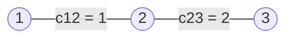

Consider an electrical network. It consists of nodes connected by conductors. We know which nodes are connected and how well each connection conducts current. Current is injected into the network at one node and withdrawn at another. How can we determine the node potentials and the currents through all the connections?

This problem can be written as a system of linear equations. Its matrix is called the **graph Laplacian**. The same matrix defines a quadratic form that, in the electrical interpretation, gives the dissipated power.

We will explore these representations through one small example. Familiarity with linear equations is sufficient; the meaning of the matrices will be explained along the way. All networks considered here consist of linear resistive connections, with currents assumed to be in a steady state.

## Connections and their weights

A **graph** consists of vertices and edges connecting them. Label the vertices $1,\ldots,n$. Assign a connection weight $c_{ij}$ to each pair of distinct vertices.

We consider an undirected graph with nonnegative weights:
$$
c_{ij}=c_{ji}\geq0,\qquad c_{ii}=0.
$$
If $c_{ij}>0$, there is an edge between the vertices; if $c_{ij}=0$, there is no direct connection. Loops, which connect a vertex to itself, are excluded here. The weights form the **weighted adjacency matrix** $C=(c_{ij})$.

In an electrical network, $c_{ij}$ is the **conductance** of the edge. It is the reciprocal of its resistance:
$$
r_{ij}=\frac1{c_{ij}}\qquad(c_{ij}>0).
$$
A higher conductance allows a larger current to flow under the same potential difference. Thus, a weight in this model measures the strength of a connection. Replacing it with a road length or travel time would change its meaning: larger values of those weights usually mean a greater obstacle to movement.

Consider a path with three vertices:

> [!example] Example. A path with three vertices
> Vertices 1 and 3 have no direct connection, but they are connected through vertex 2. Conductances are given in siemens; the resistances of the two edges are $1$ and $1/2$ ohm, respectively. The adjacency matrix is
> $$
> C=\begin{pmatrix}
> 0&1&0\\
> 1&0&2\\
> 0&2&0
> \end{pmatrix}.
> $$
> The layout is only illustrative: the lengths of the drawn segments do not specify resistances.

## Potentials and currents

Assign an electrical potential $\varphi_i$ to each vertex. The potential difference $\varphi_i-\varphi_j$ is the voltage between the vertices. By Ohm's law, the current from $i$ to $j$ is
$$
I_{ij}=c_{ij}(\varphi_i-\varphi_j).
\tag{1}
$$
The sign indicates the direction: if $I_{ij}>0$, current flows from $i$ to $j$; if $I_{ij}<0$, it flows in the opposite direction. For the same connection, $I_{ji}=-I_{ij}$. The direction of current is determined by the potentials and does not make the underlying graph directed.

Let $J_i$ denote the current entering vertex $i$ **from an external source**. A positive $J_i$ means current is injected into the network; a negative value means it is withdrawn. When $J_i=0$, the net external current at that vertex is zero. In our example, this is a vertex with no external connection.

In a steady state, charge does not accumulate at a node. Hence, the total current leaving a vertex along its edges equals the external inflow:
$$
\sum_jc_{ij}(\varphi_i-\varphi_j)=J_i.
\tag{2}
$$
This is Kirchhoff's current law for one vertex. Adding these equations over all vertices cancels the internal currents and gives the necessary condition
$$
\sum_i J_i=0.
$$
All current injected into the network must be withdrawn somewhere.

In our example, inject $2$ amperes at vertex 1 and withdraw the same current at vertex 3. Then $J=(2,0,-2)^{\mathsf T}$, and the balance equations are
$$
\begin{aligned}
\varphi_1-\varphi_2&=2,\\
(\varphi_2-\varphi_1)+2(\varphi_2-\varphi_3)&=0,\\
2(\varphi_3-\varphi_2)&=-2.
\end{aligned}
\tag{3}
$$
The same current of $2$ amperes flows through both edges. The voltages differ: the first edge has a voltage drop of $2$ volts, and the second has a drop of $1$ volt because its conductance is twice as large.

## How the Laplacian arises

Collect the coefficients of equations (2) into a matrix. Write the total weight of the connections at a vertex as
$$
d_i=\sum_jc_{ij}.
$$
The number $d_i$ is called the **weighted degree of the vertex**. If every existing edge has weight 1, it equals the ordinary degree, the number of neighbors.

Expanding the balance equation gives
$$
d_i\varphi_i-\sum_{j\ne i}c_{ij}\varphi_j=J_i.
$$

> [!info] Definition. Laplacian
> The Laplacian of the weighted graph considered here is the matrix
> $$
> \boxed{L=\operatorname{diag}(d_1,\ldots,d_n)-C.}
> \tag{4}
> $$
> Here, $\operatorname{diag}(d_1,\ldots,d_n)$ denotes the matrix with entries $d_i$ on the diagonal and zeros elsewhere. Thus, $L_{ii}=d_i$ and $L_{ij}=-c_{ij}$ for $i\ne j$.

For our path,
$$
L=\begin{pmatrix}
1&-1&0\\
-1&3&-2\\
0&-2&2
\end{pmatrix}.
$$
All equations in (3) can now be written as a single matrix equation:
$$
\boxed{L\varphi=J.}
\tag{5}
$$
The vectors $\varphi$ and $J$ are columns of potentials and external currents. The product $L\varphi$ gives, at each vertex, the total outgoing current along its connections.

It is important to distinguish the data: **the matrix $L$ describes the network, while the vector $J$ specifies the external currents applied to it**. The same network can operate under different external currents. Conductances alone do not determine a particular potential distribution without specified external currents or boundary conditions.

Two properties of the Laplacian follow immediately from its definition: it is symmetric, and every row sums to zero. The latter reflects the fact that, for a connected graph, system (5) determines potentials only up to a common additive constant.

## Potentials are determined up to an additive constant

Currents depend only on potential differences. If we add the same number $\alpha$ to every $\varphi_i$, then
$$
(\varphi_i+\alpha)-(\varphi_j+\alpha)=\varphi_i-\varphi_j.
$$
All voltages and currents remain unchanged. In this model, the physical state of the network is determined by potential differences, rather than absolute potentials. Thus, the vectors $\varphi$ and $\varphi+\alpha\mathbf1$ describe the same state.

In matrix notation,
$$
L\mathbf1=0,\qquad L(\varphi+\alpha\mathbf1)=L\varphi,
\tag{6}
$$
where $\mathbf1$ is the column vector of ones. The nonzero vector $\mathbf1$ is mapped to zero, so $L$ is singular and has no ordinary inverse $L^{-1}$. This reflects the freedom to choose a reference potential; it is not an error in the equations.

To obtain a unique potential vector, we can impose an additional condition that selects one representative from this family of solutions. In our example, set $\varphi_3=0$. Equation (3) then gives
$$
\varphi_2=1,\qquad\varphi_1=3.
$$
The middle equation holds automatically: $(1-3)+2(1-0)=0$. It is sufficient to solve the system for the first two vertices:
$$
\begin{pmatrix}1&-1\\-1&3\end{pmatrix}
\begin{pmatrix}\varphi_1\\\varphi_2\end{pmatrix}
=\begin{pmatrix}2\\0\end{pmatrix}.
$$
This smaller matrix is invertible. For a connected graph, fixing the potential of one vertex in this way removes the ambiguity.

Alternatively, we can require the mean potential to be zero. Subtract the mean $4/3$ from all three values:
$$
\widetilde\varphi=
\begin{pmatrix}5/3\\-1/3\\-4/3\end{pmatrix},
\qquad \sum_i\widetilde\varphi_i=0.
$$
This is the same physical state: the differences across the edges are still 2 and 1. Assigning zero potential to one vertex here is a choice of reference; it does not add a conductor or change the external currents.

> [!note] Remark. A disconnected graph
> Each connected component admits its own independent additive constant for the potentials. A solution exists only if the external currents sum to zero within each component separately. Injecting current into one isolated component and withdrawing it from another is impossible in this model.

## The quadratic form of the network

Besides computing currents, the Laplacian assigns a single number to a potential distribution:
$$
\mathcal Q(\varphi)=\varphi^{\mathsf T}L\varphi.
$$
The superscript $\mathsf T$ denotes transposition: a column becomes a row. The matrix product yields a scalar. This expression is called a **quadratic form** because it consists of squares of variables and their pairwise products.

Expand it in terms of the connections. Each edge $\{i,j\}$ contributes two diagonal terms and two identical mixed terms:
$$
\begin{aligned}
\varphi^{\mathsf T}L\varphi
&=\sum_i d_i\varphi_i^2-\sum_{i,j}c_{ij}\varphi_i\varphi_j\\
&=\sum_{i<j}c_{ij}(\varphi_i^2+\varphi_j^2-2\varphi_i\varphi_j).
\end{aligned}
$$
Therefore,
$$
\boxed{\mathcal Q(\varphi)=\sum_{i<j}c_{ij}(\varphi_i-\varphi_j)^2.}
\tag{7}
$$
Summing over $i<j$ counts each undirected edge once. A sum over all ordered pairs would require a factor of $1/2$.

Every term in (7) is nonnegative. Hence, $\mathcal Q(\varphi)\geq0$; this property of the matrix is called **positive semidefiniteness**. The value is zero if and only if the potentials agree at the endpoints of every edge with positive weight. In a connected graph, this means that all vertices have the same potential. The quadratic form thus reveals, once again, the freedom to shift all potentials by a common constant.

### Electrical interpretation

The power dissipated in an edge is the product of its voltage and current. By (1),
$$
P_{ij}=(\varphi_i-\varphi_j)I_{ij}
=c_{ij}(\varphi_i-\varphi_j)^2.
$$
Thus, $\mathcal Q(\varphi)$ is the total power dissipated in the network. With potentials in volts and conductances in siemens, it is measured in watts.

For the path with potentials $(3,1,0)^{\mathsf T}$,
$$
\mathcal Q(\varphi)=1\cdot(3-1)^2+2\cdot(1-0)^2=4+2=6.
$$
The first edge dissipates 4 watts and the second dissipates 2 watts.

The same result can be obtained from the external currents. Since $L\varphi=J$,
$$
\mathcal Q(\varphi)=\varphi^{\mathsf T}J=\sum_i\varphi_i J_i.
\tag{8}
$$
Changing the reference potential leaves the right-hand side of (8) unchanged because $\sum_i J_i=0$.

## Effective resistance

Now consider the network as seen from two chosen vertices $a$ and $b$. Inject a current $I>0$ at $a$ and withdraw the same current at $b$, with zero external current at every other vertex. Assume that the graph is connected.

> [!info] Definition. Effective resistance
> The effective resistance between vertices $a$ and $b$ is the ratio of the resulting potential difference to the injected current:
> $$
> \boxed{R_{ab}=\frac{\varphi_a-\varphi_b}{I}.}
> \tag{9}
> $$

This is a property of the entire network relative to the chosen pair. It is defined even when there is no direct edge between the vertices. If an edge exists, its own resistance $r_{ab}=1/c_{ab}$ generally differs from $R_{ab}$: current may also flow along other paths.

By the linearity of $L\varphi=J$, scaling the external current scales all potential differences by the same factor. The ratio (9) therefore does not depend on the magnitude of the test current. It is also independent of the reference potential.

For this current pattern, equation (8) gives
$$
\mathcal Q(\varphi)=I\varphi_a-I\varphi_b = I(\varphi_a-\varphi_b)=I^2R_{ab}. \tag{10}
$$
Thus, the quadratic form relates the contributions of individual edges to the effective resistance of the network between the current entry and exit vertices.

In our path, a current of 2 amperes produces a potential difference of 3 volts between vertices 1 and 3. Therefore,
$$
R_{13}=\frac32\text{ ohms},\qquad \mathcal Q(\varphi)=2^2\cdot\frac32=6\text{ W}.
$$
The resistance equals the sum of the resistances of the two edges connected in series: $1+1/2=3/2$ ohms. The power agrees with the sum of the edge contributions found earlier.

## Three representations of one system

| Representation | What it shows |
|---|---|
| Weighted graph | Which vertices are connected and the weights of their connections |
| Laplacian matrix $L$ | How to compute the current balance at each vertex from the potentials |
| Quadratic form $\mathcal Q$ | How potential differences determine the total contribution of all connections |

With a fixed vertex labeling, these representations contain the same information about the network considered here. The weights can be recovered from the matrix as $c_{ij}=-L_{ij}$ for $i\ne j$. In the expanded quadratic form, the coefficient of $\varphi_i\varphi_j$ for $i<j$ is $-2c_{ij}$. This statement concerns the entire quadratic function, not a single value evaluated at chosen potentials.

The electrical interpretation gives the variables a physical meaning. Expression (7) itself can also be applied to arbitrary numerical values on the vertices: it measures their differences along connections, giving greater weight to edges with larger weights.

The Laplacian connects the local rule on each edge to the behavior of the entire network. Solving the problem for different pairs of vertices gives their effective resistances. In the next note, we will explore why these quantities can be represented as squared distances between points, and how this gives rise to a geometry of the graph.
