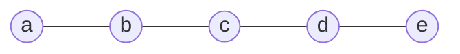
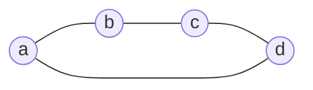

The notes [[Basic Objects and Operations of Polyform Algebra]] and [[Metric of Higher-Grade Objects]] defined the exterior product of forms and the metric values of their arguments. The Laplacian exponential collects products of coupling forms into one polyform. Its grade components describe spanning forests, and the leading coefficient of a connected graph equals its spanning-tree count.

## Laplacian polyform

Let $G$ be a connected undirected graph on vertices $a_1,\ldots,a_n$, $n\ge2$, with positive conductances $c_{ij}$ on its edges. The Laplacian polyform has grade $1$:

$$
L=\sum_{\{i,j\}\in E}c_{ij}[a_{ij}]^2
$$

For the affine vector $a_{ij}=a_j-a_i$, orientation does not affect the quadratic coupling form: $[a_{ji}]^2=[a_{ij}]^2$.

Bilinear forms use the exterior product

$$
[X,Y]\wedge[A,B]=[X\wedge A,Y\wedge B]
$$

No other product of forms is used in this note, so the sign $\wedge$ between forms is omitted below. In particular,

$$
[X]^2[A]^2=[X\wedge A]^2
$$

The product of forms is commutative: exchanging the exterior arguments produces a sign in each argument of the form, and the two signs cancel. For a vector $v$, one has $v\wedge v=0$, hence

$$
\bigl([v]^2\bigr)^2=0 \tag{1}
$$

> [!remark] Unit form
> The unit form $e$ has grade $0$ and satisfies $ef=fe=f$. Grade zero is identified with scalars, and $e$ with the scalar unit $1$. The notation $e$ makes the algebra of forms explicit.

## Exponential and factorization

Affine vectors form the space of linear combinations of vertices whose coefficients sum to zero. Its dimension is $n-1$, so $L^n=0$.

> [!definition] Metric polyform
> The **metric polyform of a graph** is the exponential of its Laplacian polyform:
>
> $$
> M_G=\exp L=e+L+\frac{L^2}{2!}+\cdots+\frac{L^{n-1}}{(n-1)!} \tag{2}
> $$
>
> All powers in formula (2) are computed using the exterior product of forms.

> [!remark] Distinction from the matrix exponential
> $L$ denotes a polyform, while $\mathbf L$ denotes the Laplacian matrix. The matrix exponential $\exp\mathbf L$ uses ordinary matrix multiplication and is a different object. Nilpotency of $L$ in the exterior algebra does not imply nilpotency of the matrix $\mathbf L$.

Commutativity of forms allows the exponential of a sum to be factored into a product of exponentials. Formula (1) truncates the exponential of each coupling after its linear term:

$$
\exp\left(c_{ij}[a_{ij}]^2\right)
=e+c_{ij}[a_{ij}]^2
$$

Therefore,

$$
M_G=\prod_{\{i,j\}\in E}\left(e+c_{ij}[a_{ij}]^2\right) \tag{3}
$$

The factor $e+c_{ij}[a_{ij}]^2$ is called the **factor-form of the coupling**. Formula (3) gives a finite construction of the exponential without computing its powers separately.

## Grade components and spanning forests

The exponential is the sum of its grade components:

$$
M_G=M_0+M_1+M_2+\cdots+M_{n-1},
\qquad
M_0=e,
\qquad
M_k=\frac{L^k}{k!}
$$

Each $M_k$ is a homogeneous polyform of grade $k$, or a grade component of $M_G$.

Expanding formula (3) selects a subset of edges $F\subseteq E$. Its contribution is the product of conductances multiplied by the quadratic form of the exterior product of its edge vectors. If $F$ contains a cycle, its vectors are linearly dependent and the contribution is zero. If $F$ is a forest, the vectors are independent and the contribution is nonzero.

Fix an arbitrary ordering and orientation of the edges, and set

$$
B_F=\bigwedge_{\{i,j\}\in F}a_{ij},
\qquad
w(F)=\prod_{\{i,j\}\in F}c_{ij}
$$

The sign of $B_F$ depends on these choices, but the form $[B_F]^2$ does not. This gives the forest expansion

$$
M_k=\sum_{\substack{F\subseteq E\text{ is a forest}\\|F|=k}}w(F)[B_F]^2 \tag{4}
$$

All vertices of the graph are retained: vertices untouched by the selected edges are isolated components of the forest. A forest with $k$ edges therefore has $n-k$ components.

The vectors of each tree fuse, up to sign, into the boundary on its vertices. Distinct trees give the exterior product of their component boundaries. For example,

$$
[(ab)]^2[(bc)]^2=[(abc)]^2,
\qquad
[(ab)]^2[(cd)]^2=[(ab)(cd)]^2
$$

The argument $(abc)$ is the boundary of a triangle, not the simplex $[abc]$.

The total weight of forests of each grade is defined separately:

$$
s_k(G)=\sum_{\substack{F\subseteq E\text{ is a forest}\\|F|=k}}w(F),
\qquad
s_0=1,
\qquad
s_1=\sum_{\{i,j\}\in E}c_{ij}
$$

For unit conductances, $s_k$ counts forests with $k$ edges. The sequence of these numbers is the $f$-vector of the independence complex of the graphic matroid.

> [!remark] Sum of forest coefficients
> The quantity $s_k$ is the sum of coefficients specifically in the forest expansion of formula (4). Forest forms may satisfy linear relations. The sum of coefficients after an arbitrary rewriting of $M_k$ therefore need not equal $s_k$.

## Example: a path on five vertices

Consider the path $P_5$ with unit conductances.

> [!example] Exponential of the path
> The metric polyform is
>
> $$
> M_{P_5}=(e+[(ab)]^2)(e+[(bc)]^2)(e+[(cd)]^2)(e+[(de)]^2)
> $$
>
> The same polyform as a sum of grade components:
>
> $$
> M_{P_5}=M_0+M_1+M_2+M_3+M_4=e+M_1+M_2+M_3+M_4
> $$
>
> The components of this expansion are
>
> $$
> M_0=e
> $$
>
> $$
> M_1=[(ab)]^2+[(bc)]^2+[(cd)]^2+[(de)]^2
> $$
>
> $$
> \begin{aligned}
> M_2={}&[(abc)]^2+[(bcd)]^2+[(cde)]^2+\\
> &+[(ab)(cd)]^2+[(ab)(de)]^2+[(bc)(de)]^2
> \end{aligned}
> $$
>
> $$
> M_3=[(abcd)]^2+[(bcde)]^2+[(abc)(de)]^2+[(ab)(cde)]^2
> $$
>
> $$
> M_4=[(abcde)]^2
> $$
>
> Every subset of the path's edges is a forest. The sums of coefficients are therefore binomial coefficients:
>
> $$
> (s_0,s_1,s_2,s_3,s_4)=(1,4,6,4,1)
> $$
>
> In $M_2$, the boundaries $(abc)$, $(bcd)$, and $(cde)$ describe trees on three vertices; the two remaining vertices of each forest are isolated. The terms $[(ab)(cd)]^2$, $[(ab)(de)]^2$, and $[(bc)(de)]^2$ describe two disconnected edges and one isolated vertex. All six forests have three components.
>
> In $M_3$, each forest has two components. For example, the argument $(abc)(de)$ contains the boundary of the tree on $a,b,c$ and the boundary of the edge on $d,e$. The only forest with four edges is the path itself.

## Top-grade form and spanning-tree coefficient

A forest with $n-1$ edges on $n$ vertices is a spanning tree. The product of its edge vectors equals, up to sign, the boundary $(a_1\ldots a_n)$. The quadratic forms of all spanning trees therefore coincide.

> [!definition] Spanning-tree form and coefficient
> Fix the **spanning-tree form**
>
> $$
> T_n=[(a_1\ldots a_n)]^2
> $$
>
> The highest-grade component of the metric polyform has the form
>
> $$
> M_{n-1}=\tau(G)T_n,
> \qquad
> \tau(G)=\sum_{T\text{ is a spanning tree}}\prod_{\{i,j\}\in T}c_{ij} \tag{5}
> $$
>
> The coefficient $\tau(G)$ is called the **spanning-tree coefficient**, or **weighted spanning-tree count**. For unit conductances, it counts spanning trees.

In the project's terminology, $T_n$ is also called the **top-grade form**, and $\tau(G)T_n$ the **top-grade component**. The component $M_{n-2}$ lies **immediately below the top grade**; it collects spanning forests with two components. For a connected graph, $s_{n-1}=\tau(G)$.

Formula (5) expresses the weighted spanning-tree count in the language of exterior products. By Kirchhoff's theorem, the same coefficient equals any principal minor of order $n-1$ of the Laplacian matrix.

The existence of a spanning tree and positivity of the conductances imply $L^{n-1}\ne0$. The highest nonzero power of $L$ is therefore $n-1$, and its nilpotency index is $n$:

$$
L^{n-1}\ne0,
\qquad
L^n=0,
\qquad
\deg M_G=\operatorname{rank}\mathbf L=n-1
$$

### Four-cycle

Consider the cycle $C_4$ with unit conductances.

> [!example] Four spanning trees
> The exponential has the form
>
> $$
> M_{C_4}=(e+[(ab)]^2)(e+[(bc)]^2)(e+[(cd)]^2)(e+[(da)]^2)
> $$
>
> Its grade expansion is
>
> $$
> M_{C_4}=M_0+M_1+M_2+M_3=e+M_1+M_2+M_3
> $$
>
> Its components are
>
> $$
> M_0=e,
> \qquad
> M_1=[(ab)]^2+[(bc)]^2+[(cd)]^2+[(da)]^2
> $$
>
> $$
> \begin{aligned}
> M_2={}&[(abc)]^2+[(bcd)]^2+[(acd)]^2+[(abd)]^2+\\
> &+[(ab)(cd)]^2+[(bc)(da)]^2
> \end{aligned}
> $$
>
> Any three of the four edges form a spanning tree. Each of the four contributions equals $[(abcd)]^2$, so
>
> $$
> M_3=4[(abcd)]^2,
> \qquad
> \tau(C_4)=4
> $$
>
> The vectors of the full cycle satisfy $(ab)+(bc)+(cd)+(da)=0$. The product of all four coupling forms is zero, and $M_4=0$.

The path $P_5$ and the cycle $C_4$ each have four edges. Their forest coefficients agree through grade three, but their top-grade components differ:

| Graph | Sums of forest coefficients | Top grade | Spanning-tree count |
|---|---|---:|---:|
| $P_5$ | $1,4,6,4,1$ | 4 | 1 |
| $C_4$ | $1,4,6,4$ | 3 | 4 |

### Weighted triangle

> [!example] Conductances and spanning-tree weights
> Let the conductances of edges $ab$, $bc$, and $ac$ be $\alpha$, $\beta$, and $\gamma$. Then
>
> $$
> \begin{aligned}
> M_G={}&e+\alpha[(ab)]^2+\beta[(bc)]^2+\gamma[(ac)]^2+\\
> &+(\alpha\beta+\alpha\gamma+\beta\gamma)[(abc)]^2
> \end{aligned}
> $$
>
> The three spanning trees have weights $\alpha\beta$, $\alpha\gamma$, and $\beta\gamma$. Their forms coincide, and their weights add:
>
> $$
> \tau(G)=\alpha\beta+\alpha\gamma+\beta\gamma
> $$

## Disconnected graph

If the graph has $c$ connected components, including isolated vertices, its edge vectors span a space of dimension $r=n-c$. Maximal forests consist of spanning trees of the individual components. Therefore,

$$
\deg M_G=\operatorname{rank}\mathbf L=n-c,
\qquad
L^{n-c}\ne0,
\qquad
L^{n-c+1}=0
$$

For a graph with no edges, $L=0$, $M_G=e$, and the highest nonzero power is understood as $L^0=e$.

> [!example] Two disconnected edges
> For unit edges $ab$ and $cd$,
>
> $$
> M_G=e+[(ab)]^2+[(cd)]^2+[(ab)(cd)]^2
> $$
>
> The graph has two components, while its top-grade component contains one quadratic form. Its argument is the product of two component boundaries. The top grade is $4-2=2$.

For a general disconnected graph, the argument of the top-grade form is the product of the boundaries of its components, and the coefficient of this form is the product of their spanning-tree coefficients. An isolated vertex contributes the boundary $(a)=1$ and spanning-tree coefficient $1$.

The number of graph components is determined by $c=n-\deg M_G$. It cannot be identified with the number of terms in the top-grade component; isolated vertices also do not appear as separate factors of positive grade in its argument.

## Potential and normalized potential

Return to a connected graph. In the space of boundary forms on fixed vertices, the top grade $n-1$ is one-dimensional. For any polyform $P$ on this space, define $\tau(P)$ as the coefficient of the fixed form $T_n$:

$$
P_{n-1}=\tau(P)T_n
$$

In particular, $\tau(M_G)=\tau(G)$.

> [!definition] Potential of a form
> The **polyform potential of a form** $f$ in the metric $M_G$ is
>
> $$
> u_{M_G}(f)=\tau(M_Gf) \tag{6}
> $$
>
> Its **normalized potential** is
>
> $$
> \frac{u_{M_G}(f)}{u_{M_G}(e)}
> =\frac{\tau(M_Gf)}{\tau(M_G)}
> $$

Formula (6) extracts the coefficient of the same $T_n$. If the highest grade of the product is less than $n-1$, this coefficient is zero; no new top-grade form is chosen for the product.

> [!remark] The term “norm”
> In PMG, the normalized potential is also called the norm of a form. For a quadratic vector form, it equals the square of the ordinary Euclidean norm in the resistance metric. For an arbitrary form, this evaluation is not a norm in the standard sense: it is linear in the form and can have either sign.

For boundaries $X$ and $Y$ of the same grade, normalized potentials reproduce their metric values:

$$
\frac{\tau(M_G[X,Y])}{\tau(M_G)}=X\cdot Y,
\qquad
\frac{\tau(M_G[X]^2)}{\tau(M_G)}=X^2 \tag{7}
$$

For a vector $v$, this equality follows from the [[Variation of a Single Edge|single-edge variation formula]]. Adding the coupling $t[v]^2$ multiplies the metric polyform by $e+t[v]^2$, so

$$
M'_G=M_G(e+t[v]^2),
\qquad
\tau(M'_G)=\tau(M_G)+t\tau(M_G[v]^2)
$$

The matrix variation formula gives $\tau(M'_G)/\tau(M_G)=1+tv^2$. Comparing coefficients of $t$ proves the quadratic case of formula (7) for grade one.

For $X=u_1\wedge\cdots\wedge u_k$, comparing mixed coefficients in [[Varying several couplings together|joint variation]] gives

$$
\frac{\tau(M_G[X]^2)}{\tau(M_G)}
=\det\bigl(u_i\cdot u_j\bigr)_{i,j=1}^k=X^2
$$

For $X=u_1\wedge\cdots\wedge u_k$ and $Y=v_1\wedge\cdots\wedge v_k$, the bilinear equality in formula (7) follows from the complementary-minor identity for the reduced Laplacian matrix: normalized complementary minors are expressed by minors of its inverse, which are mixed Gram determinants. Linear extension gives the equality for arbitrary boundary objects of the same grade. This is the metric defined in the preceding note.

If $f$ has grade $k$, only $M_{n-1-k}$ contributes to its potential:

$$
u_{M_G}(f)=\tau(M_{n-1-k}f)
$$

In particular, the component $M_{n-2}$ immediately below the top grade determines the metric evaluations of first-grade forms.

> [!example] Calculating potentials and norms
> For the path $P_5$, all four terms of $M_3$ give $T_5$ after multiplication by $[(ae)]^2$. Therefore,
>
> $$
> u_{M_{P_5}}([(ae)]^2)=4,
> \qquad
> (ae)^2=\frac41=4
> $$
>
> The potential and the norm of the form coincide because $\tau(P_5)=1$. The quantity $(ae)^2$ equals the resistance of four unit edges in series.
>
> For the cycle $C_4$, multiplication of the six terms of $M_2$ by $[(ab)]^2$ makes three vanish and gives $T_4$ for the other three. Hence,
>
> $$
> u_{M_{C_4}}([(ab)]^2)=3,
> \qquad
> (ab)^2=\frac34
> $$
>
> The potential of the form is $3$, and its norm is $3/4$: normalization divides the potential by $\tau(C_4)=4$. An independent electrical check uses the direct edge of resistance $1$ in parallel with a path of resistance $3$, giving effective resistance $1\cdot3/(1+3)=3/4$.

The Laplacian exponential defines the metric polyform together with its forest expansion. Extracting the top-grade coefficient after multiplication by an object's form connects this expansion with the resistance metric and Gram determinants.
