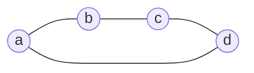

В [[Совместная вариация нескольких связей|совместных вариациях связей]] смешанные коэффициенты выражаются определителями Грама нескольких аффинных векторов. Алгебра полиформ позволяет сопоставить такой системе векторов один формальный объект и выполнять операции с ним до задания численной метрики.

Основой служит внешняя алгебра. Формы и их произведение вводятся отдельными определениями; скалярное произведение для этих определений не требуется. Связь с резистивной метрикой рассматривается в конце заметки и развивается в следующей статье.

## Точки и аффинные векторы

Пусть $V$ является вещественным линейным пространством с **линейно независимым** базисом $a_1,\ldots,a_n$. Базисные элементы представляют вершины. Для линейных комбинаций различаем точки и аффинные векторы по сумме коэффициентов.

> [!info] Точки и векторы
> **Определение.** Комбинация $x=\sum_i x_i a_i$ является точкой, если $\sum_i x_i=1$, и аффинным вектором, если $\sum_i x_i=0$.
>
> Пространство аффинных векторов обозначим через
>
> $$
> W=\left\{\sum_i u_i a_i:\sum_i u_i=0\right\},\qquad \dim W=n-1
> $$

Например, $(a+b)/2$ является точкой, а $a+b-2c$ является аффинным вектором. Разность двух точек принадлежит $W$. Прежнее обозначение сохраняется:

$$
a_{ij}=a_j-a_i
$$

Формальные базисные точки в $V$ не отождествляются с центрированными радиус-векторами предыдущих заметок. Центрирование там задавало евклидовы координаты; линейная независимость базовых вершин здесь относится к исходной алгебраической конструкции.

## Внешнее произведение и грейд

Внешнее произведение $\wedge$ билинейно, ассоциативно и для элементов $x,y\in V$ удовлетворяет

$$
x\wedge y=-y\wedge x,\qquad x\wedge x=0
$$

> [!info] Внешние объекты
> **Определение.** Линейные комбинации произведений $x_1\wedge\cdots\wedge x_k$ образуют пространство $\Lambda^kV$. Его элементы называются внешними объектами грейда $k$.
>
> Скаляр $1$ имеет грейд $0$ и является единицей внешнего произведения. Произведение объектов грейдов $k$ и $m$ имеет грейд $k+m$, если оно ненулевое.

Для однородных объектов выполняется

$$
X\wedge Y=(-1)^{km}Y\wedge X
$$

Внешнее произведение $k$ элементов первого грейда равно нулю тогда и только тогда, когда эти элементы линейно зависимы.

Ориентированный симплекс записывается как

$$
[a_1\ldots a_k]=a_1\wedge\cdots\wedge a_k
$$

Его грейд равен числу вершин. Поэтому $[abc]$ имеет грейд $3$, хотя геометрический треугольник двумерен. Перестановка двух вершин меняет знак; повторение вершины даёт нуль. Общий внешний объект может быть линейной комбинацией симплексов и не обязан быть одним внешним произведением.

## Граничный оператор

> [!info] Граница
> **Определение.** Линейный граничный оператор задаётся условиями
>
> $$
> \partial1=0,\qquad \partial a_i=1
> $$
>
> и для $k\ge1$ правилом
>
> $$
> \partial[a_1\ldots a_k]=\sum_{i=1}^k(-1)^{i-1}[a_1\ldots\widehat{a_i}\ldots a_k]
> \tag{1}
> $$
>
> Знак над $a_i$ означает пропуск этого элемента; пустое внешнее произведение равно $1$. Ненулевая граница имеет грейд на единицу меньше исходного объекта.

Равенство $\partial a_i=1$ входит в определение: справа стоит скаляр грейда $0$, а не дополнительная вершина. По линейности

$$
\partial\left(\sum_i x_i a_i\right)=\sum_i x_i
$$

Поэтому граница аффинного вектора равна нулю, а граница точки равна единице.

Границы симплексов обозначаем круглыми скобками:

$$
(ab)=\partial[ab]=b-a,\qquad
(abc)=\partial[abc]=[bc]-[ac]+[ab]
$$

В частности, $(a_i a_j)=a_{ij}$. В сокращённой индексной записи $(ij)$ также означает $a_{ij}$. Симплекс $[abc]$ и его граница $(abc)$ являются разными объектами грейдов $3$ и $2$.

> [!info] Свойства границы
> **Лемма.** Для однородного $X$ грейда $k$
>
> $$
> \partial^2=0,\qquad
> \partial(X\wedge Y)=\partial X\wedge Y+(-1)^kX\wedge\partial Y
> \tag{2}
> $$

В первом равенстве каждое удаление двух вершин в (1) встречается дважды с противоположными знаками. Во втором слагаемые разделяются на удаления из $X$ и из $Y$; перед удалением из $Y$ находятся $k$ множителей объекта $X$. Это доказывает оба свойства по линейности.

## Границы и внешние степени аффинных векторов

> [!info] Пространство границ
> **Лемма.** Для каждого грейда $k$ пространство границ совпадает с $\Lambda^kW$. Иначе говоря, для $B\in\Lambda^kV$ равносильны условия: $B$ является границей, $\partial B=0$ и $B\in\Lambda^kW$.

> [!note]- Доказательство
> **Доказательство.** Зафиксируем базовую точку $a_1$. Она дополняет $W$ до $V$, поэтому любой объект $B$ грейда $k\ge1$ единственным образом представляется как
>
> $$
> B=D+a_1\wedge C,\qquad
> D\in\Lambda^kW,\quad C\in\Lambda^{k-1}W
> $$
>
> Граница каждого вектора из $W$ равна нулю. По (2) получаем $\partial D=\partial C=0$ и $\partial B=C$. Поэтому условие $\partial B=0$ равносильно $B\in\Lambda^kW$.
>
> Для такого $B$ имеем $\partial(a_1\wedge B)=B$, то есть $B$ является границей. Обратно, граница удовлетворяет $\partial B=0$ в силу $\partial^2=0$. При $k=0$ любой скаляр $s$ равен $\partial(sa_1)$, что завершает доказательство. $\square$

Таким образом, границы образуют подалгебру внешней алгебры: произведение границ снова является границей. Ненулевые границы имеют грейды от $0$ до $n-1$. Это ограничение следует из $\dim W=n-1$.

## Произведения границ симплексов

Для базовых вершин $p,a_1,\ldots,a_r$ из (1) следует

$$
(pa_1\ldots a_r)=(a_1-p)\wedge\cdots\wedge(a_r-p)
\tag{3}
$$

Рассмотрим границы двух симплексов на базовых вершинах, каждый из которых содержит не менее двух вершин. Если их единственная общая вершина $p$ поставлена первой в обоих списках, то (3) даёт

$$
(pa_1\ldots a_r)\wedge(pb_1\ldots b_s)=(pa_1\ldots a_r b_1\ldots b_s)
$$

При других порядках вершин учитывается знак соответствующих перестановок. Если общих вершин не менее двух, произведение равно нулю: при выборе одной общей вершины $p$ оба произведения в (3) содержат разность со второй общей вершиной. Если множества вершин не пересекаются, произведение ненулевое и остаётся произведением двух границ.

Эти правила относятся именно к границам симплексов на базовых вершинах. Для произвольных линейных комбинаций произведение вычисляется по билинейности, а не по списку встречающихся в записи вершин.

> [!example] Произведения границ
>
> $$
> (ab)\wedge(bc)=(b-a)\wedge(c-b)=[bc]-[ac]+[ab]=(abc)
> $$
>
> $$
> (abc)\wedge(bc)=0,\qquad
> (ab)\wedge(cd)=[bd]-[bc]-[ad]+[ac]
> $$

Далее знак $\wedge$ между внешними объектами можно опускать, если операция однозначна: например, $(ab)(bc)=(abc)$.

> [!info] Рёберные произведения
> **Теорема.** Внешнее произведение векторов выбранных рёбер ненулевое тогда и только тогда, когда эти рёбра образуют лес. Для дерева на вершинах $a_{i_1},\ldots,a_{i_s}$ произведение равно $\pm(a_{i_1}\ldots a_{i_s})$. Для леса получается произведение границ его компонент с точностью до ориентационного знака.

> [!note]- Доказательство
> **Доказательство.** Векторы рёбер цикла линейно зависимы: после согласования направлений их сумма равна нулю. Поэтому наличие цикла обнуляет всё произведение, в том числе при наличии других компонент.
>
> В лесу векторы независимы. В любой линейной зависимости коэффициент при вершине-листе заставляет коэффициент её единственного ребра быть нулевым. Последовательное удаление листьев обнуляет все коэффициенты зависимости.
>
> Для дерева правило слияния по одной общей вершине, применяемое при последовательном присоединении листьев, даёт границу всего дерева с точностью до знака. Для леса оно применяется в каждой компоненте. Изолированная вершина даёт множитель $\partial a_i=1$. $\square$

## Формы: билинейность и основные операции

> [!info] Формы одного грейда
> **Определение.** Для $X,Y\in\Lambda^kV$ вводятся формальные символы $[X,Y]$. Они порождают линейное пространство форм грейда $k$ с единственными соотношениями билинейности:
>
> $$
> [\alpha X+\beta Z,Y]=\alpha[X,Y]+\beta[Z,Y]
> $$
>
> $$
> [X,\alpha Y+\beta Z]=\alpha[X,Y]+\beta[X,Z]
> $$
>
> В каждой формуле все аргументы имеют грейд $k$, а $\alpha,\beta\in\mathbb R$. Симметрия $[X,Y]=[Y,X]$ не предполагается.

Такое определение задаёт формальный объект, а не число и не числовую билинейную функцию на $V$. Если $E_1,\ldots,E_N$ образуют базис $\Lambda^kV$, то формы $[E_i,E_j]$ образуют базис пространства форм этого грейда.

> [!info] Квадратичная, транспонированная и полярная формы
> **Определение.** Для аргументов одного грейда полагаем
>
> $$
> [X]^2=[X,X],\qquad [X,Y]^{\mathsf T}=[Y,X]
> $$
>
> $$
> \{X,Y\}=[X,Y]+[Y,X]
> $$
>
> Транспонирование продолжается на линейные комбинации. Полярная форма выбрана без множителя $1/2$.

Из билинейности следует

$$
[X+Y]^2=[X]^2+\{X,Y\}+[Y]^2
$$

Примеры: $[a]^2$ является формой точки, $[(ab)]^2$ формой аффинного вектора, $[(abc)]^2$ формой границы второго грейда. Обращение ориентации аргумента не меняет квадратичную форму: $[-X]^2=[X]^2$.

Запись $[X]^2$ обозначает форму. Она не означает ни внешнее произведение $X\wedge X$, ни численный квадрат нормы. Численные метрические величины будут определены отдельно.

## Тождество четырёх точек

> [!info] Тождество полярных форм
> **Лемма.** Для любых четырёх точек $a_i,a_j,a_k,a_l$ и их аффинных разностей $a_{ij}=a_j-a_i$ выполняется равенство форм
>
> $$
> \{a_{ij},a_{kl}\}+\{a_{jk},a_{il}\}+\{a_{ik},a_{lj}\}=0
> \tag{4}
> $$
>
> Совпадение точек допускается. Выбор метрики для этого равенства не требуется.

> [!note]- Доказательство
> **Доказательство.** Положим $u=a_{ij}$, $v=a_{jk}$, $w=a_{kl}$. Тогда
>
> $$
> a_{il}=u+v+w,\qquad a_{ik}=u+v,\qquad a_{lj}=-v-w
> $$
>
> Левая часть (4) равна
>
> $$
> \{u,w\}+\{v,u+v+w\}-\{u+v,v+w\}
> $$
>
> По определению полярная форма билинейна и симметрична, поэтому
>
> $$
> \{v,u+v+w\}=\{u,v\}+\{v,v\}+\{v,w\}
> $$
>
> $$
> \{u+v,v+w\}=\{u,v\}+\{u,w\}+\{v,v\}+\{v,w\}
> $$
>
> После подстановки все слагаемые сокращаются. $\square$

Тождество (4) является структурным: оно выражает линейную зависимость полярных форм разностей четырёх точек. Его скалярная версия рассмотрена в [[Скалярное произведение векторов графа#Тождество четырёх точек|заметке о скалярном произведении]]. Переход к ней через метрическую оценку описан ниже.

## Полиформы и произведение форм

> [!info] Полиформа
> **Определение.** Полиформа является конечной линейной комбинацией форм, в том числе разных грейдов. Если все слагаемые имеют грейд $k$, полиформа однородна. Общая полиформа имеет разложение
>
> $$
> P=P_0+P_1+\cdots+P_n
> $$
>
> где $P_k$ является её грейд-компонентой.

> [!info] Произведение форм
> **Определение.** Для форм грейдов $k$ и $m$ положим
>
> $$
> [X,Y]\wedge[A,B]=[X\wedge A,Y\wedge B]
> \tag{5}
> $$
>
> Произведение продолжается по билинейности на полиформы. Его единица есть форма $e=[1,1]$ грейда $0$.

Внутри аргументов (5) используется внешнее произведение объектов. Между формами тот же знак обозначает определённую через него операцию. Далее знак $\wedge$ между формами опускается: $[X,Y][A,B]$ означает именно произведение (5).

Скаляр $1$ и форма $e$ принадлежат разным уровням конструкции. По билинейности $[s,t]=st\,e$ для скаляров $s,t$, а $eF=Fe=F$ для любой формы.

> [!info] Свойства умножения
> **Теорема.** Произведение полиформ ассоциативно, дистрибутивно и коммутативно. Грейды ненулевых произведений однородных форм складываются.

> [!note]- Доказательство
> **Доказательство.** Билинейность внешнего произведения обеспечивает согласованность (5) с соотношениями, определяющими формы. Ассоциативность и дистрибутивность наследуются от операций в аргументах.
>
> При перестановке форм грейдов $k$ и $m$ в каждом аргументе возникает знак $(-1)^{km}$. По билинейности оба знака перемножаются:
>
> $$
> [X\wedge A,Y\wedge B]=(-1)^{2km}[A\wedge X,B\wedge Y]=[A\wedge X,B\wedge Y]
> $$
>
> Это доказывает коммутативность. Сложение грейдов следует из (5). $\square$

Для квадратичных форм имеем

$$
[X]^2[A]^2=[X\wedge A]^2
\tag{6}
$$

Например, $[(ab)]^2[(bc)]^2=[(abc)]^2$. Ориентационный знак произведения границ при переходе к квадратичной форме исчезает.

## Нильпотентность и формы на границах

Для любого $v\in V$ положим $q_v=[v]^2$. Из (6) следует

$$
q_v^2=[v\wedge v]^2=0
$$

При этом форма $q_v$ ненулевого вектора сама ненулевая. Свойство означает, что её произведение с самой собой равно нулю.

Более общо,

$$
[v_1]^2\cdots[v_r]^2=[v_1\wedge\cdots\wedge v_r]^2
\tag{7}
$$

Произведение (7) равно нулю тогда и только тогда, когда векторы зависимы. В частности, произведение форм рёбер цикла равно нулю.

Формы $[X,Y]$ с аргументами $X,Y\in\Lambda^kW$ образуют подалгебру форм на границах. Она содержит $e$, замкнута относительно произведения и имеет грейды от $0$ до $n-1$. Поэтому для любой полиформы $P$ из этой подалгебры с $P_0=0$ выполняется $P^n=0$: каждый член произведения $n$ множителей имел бы грейд не меньше $n$.

Это не означает, что квадрат всякой формы положительного грейда равен нулю. Например, для независимых аффинных векторов $u,v$

$$
\bigl([u]^2+[v]^2\bigr)^2=2[u\wedge v]^2\ne0
$$

## Метрическая оценка

Пусть на $W$ задано положительно определённое скалярное произведение, например резистивная метрика связного графа. Оно индуцирует метрику на каждой внешней степени $\Lambda^kW$. Для простого внешнего объекта

$$
\|u_1\wedge\cdots\wedge u_k\|^2=\det(u_i\cdot u_j)_{i,j=1}^k
$$

При численной оценке форма $[X,Y]$ получает значение $X\cdot Y$. По билинейности это определяет линейную оценку форм на границах одного грейда. В частности, $[X]^2$ оценивается как $\|X\|^2$, а $\{X,Y\}/2$ как $X\cdot Y$.

В частности, метрическая оценка каждого слагаемого в (4) равна удвоенному скалярному произведению. После деления на $2$ получаем

$$
a_{ij}\cdot a_{kl}+a_{jk}\cdot a_{il}+a_{ik}\cdot a_{lj}=0
$$

Оценка произведения (7) равна определителю Грама исходных векторов. Она в общем случае не равна произведению оценок отдельных форм: для двух векторов получается $\|u\|^2\|v\|^2-(u\cdot v)^2$.

Метрика на $W$ не задаёт автоматически норму формальной точки или произвольного симплекса в $V$. В следующей заметке рассматривается именно метрика на границах в каждом грейде.

## Полиформное представление лапласиана

Для неориентированного графа положим

$$
L=\sum_{i<j}c_{ij}[a_{ij}]^2=\sum_{i<j}c_{ij}[(ij)]^2
\tag{8}
$$

Это однородная полиформа первого грейда на границах. Если требуется одновременно матричное представление, обозначаем его через $\mathbf L$. Коэффициентная матрица формы (8) в базисных формах $[a_i,a_j]$ совпадает с обычным лапласианом, поскольку

$$
[a_j-a_i]^2=[a_i]^2+[a_j]^2-\{a_i,a_j\}
$$

Однако умножение форм (5) отличается от матричного умножения, поэтому $L^2$ и $\mathbf L^2$ обозначают разные объекты.

Рассмотрим единичный цикл $C_4$.

> [!example] Матрица и полиформа цикла
> В порядке вершин $a,b,c,d$ матричный лапласиан и полиформа равны
>
> $$
> \mathbf L=\begin{pmatrix}
> 2&-1&0&-1\\
> -1&2&-1&0\\
> 0&-1&2&-1\\
> -1&0&-1&2
> \end{pmatrix}
> $$
>
> $$
> L=[(ab)]^2+[(bc)]^2+[(cd)]^2+[(da)]^2
> $$
>
> Две соседние связи дают $[(ab)]^2[(bc)]^2=[(abc)]^2$, а две несмежные дают $[(ab)]^2[(cd)]^2=[(ab)(cd)]^2$.
>
> Три последовательные связи дают
>
> $$
> [(ab)]^2[(bc)]^2[(cd)]^2=[(abcd)]^2
> $$
>
> Произведение всех четырёх форм равно нулю, поскольку $(ab)+(bc)+(cd)+(da)=0$.

> [!example] Старшая степень для $C_4$
> В $L^3$ выживают наборы из трёх различных рёбер. Их четыре, каждый является остовным деревом и даёт форму $[(abcd)]^2$. Каждый набор встречается в $3!$ порядках, поэтому
>
> $$
> L^3=24[(abcd)]^2,\qquad L^4=0
> $$

## Продолжение и литература

Следующая заметка [[Метрика объектов высших грейдов]] определяет скалярные произведения границ одного грейда и их численные нормы. После неё [[Экспонента лапласиана]] объединяет степени $L$ в одну полиформу; доказанное ограничение грейда делает её экспоненциальный ряд конечным.

В [[Литература к вводной серии PMG|рекомендуемой литературе]] источники [7] и [8] посвящены внешней алгебре, билинейности и определителям Грама. Определение формальных символов $[X,Y]$ и их произведения (5) фиксирует используемую в этой серии алгебру полиформ.
