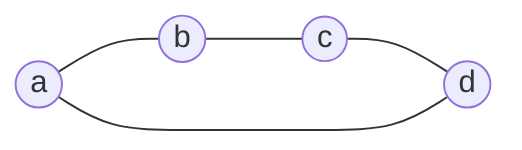

В предыдущих заметках мы использовали графовые векторы, квадратичные формы, скалярные произведения и определители Грама, не вводя отдельного языка для их совместного описания.

Особенно явно необходимость такого языка проявилась в [[Совместная вариация нескольких связей]]. Смешанный коэффициент вариации нескольких проводимостей оказался определителем Грама соответствующих графовых векторов. Геометрически тот же определитель задаёт квадрат площади, объёма или их многомерного аналога, как было показано в [[От длин к площадям и объёмам]].

Теперь введём минимальную алгебраическую конструкцию, которая позволяет работать с такими объектами непосредственно.

Эта конструкция сама по себе ещё не является метрической теорией. Сначала мы определим объекты и операции **алгебры полиформ**. Метрика появится позднее, когда этот язык будет применён к лапласиану графа.

## Три уровня конструкции

Полезно сразу разделить три уровня.

1. **Обычная линейная и внешняя алгебра.** Сюда относятся линейные комбинации, внешнее произведение, симплексы, оператор границы, билинейные и квадратичные формы, матрицы и определители Грама.
2. **Способ использования этих объектов в алгебре полиформ.** Аргументами форм могут быть не только отдельные векторы, но и внешние произведения объектов разных грейдов. Произведение форм определяется через внешнее произведение их аргументов.
3. **Собственные соглашения проекта.** К ним относятся термин «полиформа», единичная форма $e$, принятые обозначения границ и грейд-компонент, а позднее - специальные метрические конструкции.

> [!remark] Терминология
> Термины **вектор**, **симплекс**, **граница**, **внешнее произведение**, **билинейная форма**, **квадратичная форма** и **определитель Грама** являются стандартными математическими терминами.
>
> Термин **полиформа** используется и в других областях математики, но здесь имеет специальное определение: полиформой называется линейная комбинация форм, в том числе форм разных грейдов. Поэтому при первом употреблении этот смысл необходимо оговаривать.

## Точки и векторы

Пусть $a,b,c,\ldots$ обозначают базовые точки пространства. В графовой интерпретации это вершины графа. Для алгебраических операций будем рассматривать эти точки как формальные образующие линейного пространства. Это не отождествляет точку с вектором в аффинном смысле: различие между ними определяется коэффициентами линейной комбинации.

Разность двух точек определяет вектор $(ab)=b-a$.

Круглые скобки здесь являются принятым обозначением границы пары точек. Ориентация существенна: $(ba)=-(ab)$.

В более общем случае вектором является линейная комбинация точек с нулевой суммой коэффициентов. Если $v=\sum_i \lambda_i a_i$, то условие того, что $v$ является вектором, имеет вид $\sum_i\lambda_i=0$.

Например, $v=a+b-2c$ является вектором.

Аффинная комбинация с суммой коэффициентов $1$ снова задаёт точку. Например, $(a+b)/2$ является точкой середины между $a$ и $b$.

Для вводной алгебры этого различия достаточно. Более специальное описание через аффинный вес и изотропное расширение здесь не требуется.

## Внешнее произведение и симплексы

Внешнее произведение обозначается стандартным знаком $\wedge$. Для базовых объектов оно антикоммутативно: $a\wedge b=-b\wedge a$, поэтому $a\wedge a=0$.

Внешнее произведение нескольких элементов будем записывать как ориентированный симплекс $[a_1\ldots a_k]=a_1\wedge\cdots\wedge a_k$.

**Грейдом** симплекса называется число его множителей. Поэтому точка имеет грейд $1$, $[ab]$ - грейд $2$, $[abc]$ - грейд $3$.

Это соглашение отличается от стандартной геометрической размерности симплекса на единицу: $[abc]$ имеет грейд $3$, но является двумерным симплексом.

При перестановке двух соседних элементов знак симплекса меняется. Если элемент повторяется, симплекс равен нулю.

Для двух однородных внешних объектов $X$ и $Y$ грейдов $k$ и $m$ выполняется $X\wedge Y=(-1)^{km}Y\wedge X$, а грейд произведения равен $k+m$.

> [!definition] Набор
> В этой заметке **набором** будем называть конечную упорядоченную семью объектов, которую предполагается связать внешним произведением.
>
> Набор не является новым алгебраическим объектом. Он лишь фиксирует множители и их порядок. Самим внешним объектом является результат их произведения.

Такое различие полезно, поскольку один и тот же набор при перестановке множителей может изменить знак, а набор с повторяющимся элементом даёт нулевое внешнее произведение.

## Граница

Для симплексов используется стандартный оператор границы $\partial$. Для симплекса $[a_1\ldots a_k]$ его граница равна знакопеременной сумме симплексов, полученных удалением одного элемента:
$$
\partial[a_1\ldots a_k] = \sum_{i=1}^k(-1)^{i-1}[a_1\ldots\widehat{a_i}\ldots a_k]
$$
Границу будем обозначать круглыми скобками. В частности, $(ab)=\partial[ab]=b-a$, а $(abc)=\partial[abc]=[bc]-[ac]+[ab]$.

Грейд границы на единицу меньше грейда исходного симплекса. Поэтому вектор $(ab)$ имеет грейд $1$, а граница треугольника $(abc)$ - грейд $2$.

Основное стандартное свойство граничного оператора имеет вид $\partial^2=0$.

Оператор границы согласован с внешним произведением по градуированному правилу Лейбница. Если $X$ имеет грейд $k$, то
$$
\partial(X\wedge Y) = \partial X\wedge Y+(-1)^kX\wedge\partial Y
$$

## Произведение границ и связность

Границы можно перемножать внешним произведением. Для простейших графовых границ получаем $(ab)(bc)=(abc)$.

Здесь и далее знак $\wedge$ между границами иногда опускается, если это не создаёт неоднозначности.

Если две связные границы имеют ровно одну общую точку, их произведение сливается в одну связную границу. Если общих точек две или более, произведение равно нулю. Если общих точек нет, компоненты остаются раздельными.

Простейшие примеры: $(abc)(bc)=0$, $(ab)(bc)=(abc)$ и $(ab)(cd)=(ab)(cd)$.

> [!definition] Связный набор границ
> Набор границ $B_1,\ldots,B_m$ будем называть **связным**, если его нельзя разбить на две непустые группы так, чтобы границы из разных групп не имели общих базовых точек.
>
> Для набора графовых векторов $(a_ib_i)$ это совпадает с обычной графовой связностью системы соответствующих рёбер после удаления неиспользуемых вершин.

Связность набора сама по себе не гарантирует ненулевое внешнее произведение. Например, набор трёх сторон треугольника связен, но соответствующие векторы линейно зависимы, поэтому $(ab)\wedge(bc)\wedge(ca)=0$.

Если же связный набор графовых векторов не содержит такой зависимости, его произведение задаёт одну граничную компоненту. Несвязный набор даёт произведение нескольких компонент.

### Границы как замкнутый класс

Для дальнейшего применения важно, что при внешнем умножении границ мы не выходим из класса границ.

Пусть $B_1=\partial X$ и $B_2=\partial Y$. Поскольку $\partial B_2=0$, из правила Лейбница следует
$$
B_1\wedge B_2 = \partial X\wedge B_2 = \partial(X\wedge B_2)
$$
Следовательно, внешнее произведение двух границ снова является границей.

Это позволяет рассматривать граничные объекты как самостоятельную градуированную подалгебру внешней конструкции.

> [!remark] Более точная алгебраическая формулировка
> Если $\mathcal Z=\ker\partial$ - пространство циклов, а $\mathcal B=\operatorname{im}\partial$ - пространство границ, то $\mathcal B\subseteq\mathcal Z$ и $\mathcal B$ является градуированным идеалом в $\mathcal Z$.
>
> При этом $\mathcal B$ в общем случае не является идеалом всей внешней алгебры. Для дальнейшего изложения это уточнение не потребуется.

Именно эта замкнутость делает границы естественными аргументами графовой части алгебры полиформ.

## Билинейные и квадратичные формы

В стандартной линейной алгебре билинейная форма линейна по каждому из двух аргументов. В алгебре полиформ будем использовать формальную запись $[X,Y]$, где $X$ и $Y$ - внешние объекты одного грейда.

Квадратичная форма определяется как $[X]^2=[X,X]$.

Например:

- $[a]^2$ - форма точки;
- $[(ab)]^2$ - квадратичная форма графового вектора;
- $[(abc)]^2$ - квадратичная форма границы второго грейда.

Здесь важно разделять **формальный объект алгебры** и его последующую **числовую метрическую оценку**. Запись $[X]^2$ сама по себе ещё не означает конкретное число. После задания метрики такая форма может быть оценена как квадрат нормы соответствующего объекта.

Для неориентированного графового ребра квадратичная форма не зависит от выбранной ориентации, поскольку $[(ba)]^2=[-(ab)]^2=[(ab)]^2$.

Это одна из причин, по которой квадратичные формы особенно удобны для представления неориентированных связей.

## Полиформы и грейды

> [!definition] Полиформа
> **Полиформой** в этой серии называется линейная комбинация форм. Слагаемые могут иметь одинаковые или разные грейды.

Если все слагаемые имеют один грейд, полиформа называется **однородной**. Произвольную полиформу можно разложить по грейдам как $P=P_0+P_1+P_2+\cdots$, где $P_k$ - однородная компонента грейда $k$.

В проекте такую компоненту также можно называть **грейд-компонентой** или **грейд-полиформой**.

Грейд формы определяется грейдом её аргументов. Например, $[(ab)]^2$ имеет грейд $1$, а $[(abc)]^2$ - грейд $2$.

Отдельно вводится **единичная форма** $e$ грейда $0$. Она является нейтральным элементом относительно умножения форм: $eF=Fe=F$.

## Произведение форм

Ключевая операция алгебры полиформ определяется через внешнее произведение аргументов.

Пусть $[X,Y]$ и $[A,B]$ - билинейные формы. Положим
$$
[X,Y][A,B]=[X\wedge A,Y\wedge B]\tag{1}
$$
Для квадратичных форм получаем особенно простое правило
$$
[X]^2[A]^2=[X\wedge A]^2\tag{2}
$$
Если $X$ имеет грейд $k$, а $A$ - грейд $m$, то произведение имеет грейд $k+m$.

Таким образом, произведение двух квадратичных форм первого грейда уже является формой второго грейда. Например, $[(ab)]^2[(bc)]^2=[(abc)]^2$.

Алгебраический смысл повышения грейда здесь прямой: отдельные векторы объединяются внешним произведением в объект более высокого порядка.

### Почему формы коммутируют

Внешние объекты в общем случае не коммутируют. Если грейды $X$ и $A$ равны $k$ и $m$, то $X\wedge A=(-1)^{km}A\wedge X$.

Но в билинейной форме при перестановке множителей такой знак возникает одновременно в обоих аргументах. Поэтому два знака сокращаются: $[X,Y][A,B]=[A,B][X,Y]$.

Следовательно, введённое произведение форм коммутативно, хотя основано на антикоммутативном внешнем произведении.

Это свойство относится именно к умножению форм и не должно смешиваться с обычным матричным умножением.

## Нильпотентность и повторяющиеся векторы

Из внешней алгебры немедленно следует ещё одно важное свойство. Для любого вектора $v$ выполняется $v\wedge v=0$. Поэтому для квадратичной формы $q_v=[v]^2$ имеем $q_v^2=[v\wedge v]^2=0$.

Более общо, если в произведении внешних аргументов один и тот же вектор возникает повторно, соответствующее произведение форм обращается в нуль.

Например, для графовых векторов треугольника $(ab)+(bc)+(ca)=0$, поэтому они линейно зависимы и $[(ab)]^2[(bc)]^2[(ca)]^2=0$.

Таким образом, алгебра автоматически уничтожает наборы векторов, не образующие независимого внешнего объёма.

Позднее это свойство станет причиной того, что в экспоненте лапласиана сохраняются лесные, а циклические наборы связей исчезают.

## Произведение форм и определитель Грама

Связь с геометрией появляется после задания скалярного произведения.

Пусть $u_1,\ldots,u_k$ - векторы евклидова пространства. Стандартное скалярное произведение индуцирует скалярное произведение на внешней степени, для которого
$$
\left\|u_1\wedge\cdots\wedge u_k\right\|^2 = \det G(u_1,\ldots,u_k) \tag{3}
$$
где $G(u_1,\ldots,u_k)$ - матрица Грама.

С другой стороны, в алгебре полиформ
$$
[u_1]^2\cdots[u_k]^2 = [u_1\wedge\cdots\wedge u_k]^2 \tag{4}
$$
Поэтому **метрическая оценка произведения квадратичных форм первого грейда равна определителю Грама их аргументов**.

Для двух векторов это квадрат площади параллелограмма. Для трёх - квадрат объёма параллелепипеда. Для $k$ векторов - квадрат соответствующего $k$-мерного объёма.

Именно этот объект уже встречался в [[От длин к площадям и объёмам]]. Там определитель Грама был введён как числовая геометрическая характеристика. Теперь видно, какой формальный объект стоит за ним в алгебре: $[u_1]^2\cdots[u_k]^2$.

Для графовых векторов $v_1,\ldots,v_k$ метрическая оценка формы $[v_1]^2\cdots[v_k]^2$ равна $\det(\langle v_i,v_j\rangle)$. Нового оператора для этой оценки здесь вводить не будем.

> [!remark] Связь с совместными вариациями
> В [[Совместная вариация нескольких связей]] определитель Грама выбранных графовых векторов возник как смешанный коэффициент совместной вариации.
>
> Формула (4) показывает, что этот коэффициент естественно соответствует произведению квадратичных форм выбранных связей. Именно поэтому произведение форм является подходящим языком для описания вариаций нескольких связей одновременно.

## Граничная подалгебра и графы

Общая алгебра полиформ допускает формы на произвольных внешних объектах. Они не обязаны быть границами и вообще не обязаны иметь графовую интерпретацию.

При переходе к графам выделяется более узкий класс: аргументами элементарных форм служат графовые векторы $(ij)=a_j-a_i$, то есть границы первого грейда.

Поскольку произведение границ снова является границей, все произведения таких форм остаются внутри того же класса. Поэтому графовые полиформы естественно живут в **подалгебре форм на границах**.

Последовательность специализаций можно схематически записать так:
$$
\text{внешняя алгебра объектов}
\longrightarrow
\text{алгебра полиформ}
\longrightarrow
\text{полиформы на границах}
\longrightarrow
\text{графовые полиформы}
$$

Последний переход уже использует специальную структуру графа, но ещё не требует метрической интерпретации.

## Полиформное представление лапласиана

До сих пор определения были намеренно абстрактными. Теперь применим их к конкретному графу.

Рассмотрим простой цикл $C_4$ с четырьмя вершинами $a,b,c,d$ и единичными проводимостями.

Когда представление объекта однозначно из контекста, будем использовать для него обычное обозначение. Поэтому полиформу лапласиана обозначим просто через $L$. Если в одном рассуждении одновременно требуется матричное представление, матрицу будем выделять полужирным начертанием: $\mathbf L$.

Для цикла $C_4$ матричный лапласиан равен
$$
\mathbf L=
\begin{array}{c|rrrr}
 & a & b & c & d\\
\hline
a & 2 & -1 & 0 & -1\\
b & -1 & 2 & -1 & 0\\
c & 0 & -1 & 2 & -1\\
d & -1 & 0 & -1 & 2
\end{array}
$$
Заголовки строк и столбцов показывают, что матрица индексирована вершинами графа. Диагональные элементы относятся к самим вершинам и равны их степеням, а внедиагональные элементы описывают связи между соответствующими парами вершин.

Тот же граф можно записать в алгебре полиформ. Каждому ребру сопоставим его графовый вектор: $(ab)$, $(bc)$, $(cd)$ и $(da)$. Квадратичная форма каждого такого вектора представляет одну связь. Поэтому полиформное представление лапласиана имеет вид
$$
L=[(ab)]^2+[(bc)]^2+[(cd)]^2+[(da)]^2\tag{5}
$$
В дальнейшем в полиформенных формулах именно это представление будет подразумеваться под буквой $L$, если явно не сказано иное.

Теперь смысл умножения становится виден непосредственно на графе. Две соседние связи дают форму второго грейда: $[(ab)]^2[(bc)]^2=[(abc)]^2$. Две несмежные связи дают двухкомпонентную границу: $[(ab)]^2[(cd)]^2=[(ab)(cd)]^2$.

Произведение трёх последовательных рёбер цикла даёт одну границу третьего грейда: $[(ab)]^2[(bc)]^2[(cd)]^2=[(abcd)]^2$. Но произведение всех четырёх рёбер равно нулю, поскольку векторы цикла линейно зависимы: $(ab)+(bc)+(cd)+(da)=0$.

Таким образом, уже для $C_4$ видно, что полиформа не является другой записью матричного произведения. Она хранит связи как квадратичные формы графовых векторов, а её произведение собирает совместные граничные объекты более высокого грейда.

Для произвольного взвешенного графа полиформа лапласиана имеет вид
$$
L=\sum_{i<j}c_{ij}[(ij)]^2\tag{6}
$$
Каждое слагаемое имеет грейд $1$, поэтому $L$ является однородной квадратичной полиформой первого грейда.

Но её квадрат уже содержит формы второго грейда. Если обозначить $q_e=[v_e]^2$, то $L^2=\sum_{e,f}c_ec_fq_eq_f$.

При этом слагаемые с $e=f$ исчезают из-за $q_e^2=0$, а линейно зависимые наборы связей также дают нулевое внешнее произведение.

Таким образом, обычное возведение лапласиановой полиформы в степень автоматически строит объекты всё более высоких грейдов и одновременно отбрасывает вырожденные наборы связей.

> [!warning] Матрица и полиформа
> Полиформа лапласиана $L$ и матричный лапласиан $\mathbf L$ кодируют одни и те же коэффициенты связей, но принадлежат разным алгебраическим представлениям и умножаются по разным правилам.
>
> Поэтому полиформная степень $L^2$ и матричная степень $\mathbf L^2$ - разные объекты.

## Почему следующим шагом становится экспонента

Теперь естественно искать один объект, который одновременно содержит все грейды, возникающие из лапласиановой полиформы: $e$, $L$, $L^2$, $L^3$, $\ldots$

Стандартный способ собрать все степени одного элемента в единую градуированную конструкцию - экспонента $\exp L$.

В обычной алгебре это была бы бесконечная степенная серия. Здесь внешняя нильпотентность делает её конечной: достаточно высокий грейд обязательно обращается в нуль.

Кроме того, если $q_e=[v_e]^2$, то каждый элементарный член $c_eq_e$ удовлетворяет $(c_eq_e)^2=0$. Поэтому его экспонента имеет только два члена: $\exp(c_eq_e)=e+c_eq_e$.

Это уже подготавливает факторизованное представление полной экспоненты лапласиана. Но её грейдовая структура, связь с остовными лесами и метрический смысл будут предметом следующей заметки [[Экспонента лапласиана]].

## Что мы получили

Алгебра полиформ отделяет формальные операции от их метрической интерпретации.

Исходными объектами служат точки и их линейные комбинации. Внешнее произведение создаёт симплексы и объекты высших грейдов, оператор границы выделяет специальный замкнутый класс граничных объектов, а билинейные и квадратичные формы позволяют строить формы на этих объектах.

Ключевая операция определяется правилом (1): произведение форм есть форма от внешних произведений их аргументов. Отсюда следуют повышение грейда, коммутативность произведения форм и нильпотентность повторяющихся векторов.

После задания метрики произведение квадратичных форм получает числовую оценку через определитель Грама. Тем самым площади, объёмы и смешанные коэффициенты совместных вариаций оказываются различными интерпретациями одной и той же алгебраической конструкции.

Применение этой алгебры к полиформе лапласиана подготавливает следующий шаг - переход к её экспоненте и к собственно метрической конструкции Polyform Metric Geometry.
