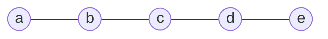
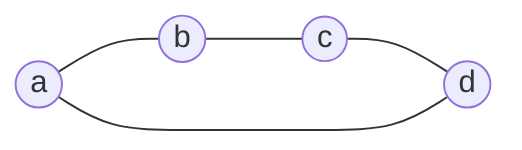

В заметках [[Основные объекты и операции алгебры полиформ]] и [[Метрика%20объектов%20высших%20грейдов|Метрика объектов высших грейдов]] были определены внешнее произведение форм и метрические величины их аргументов. Экспонента лапласиана объединяет произведения форм связей графа в одну полиформу. Её грейд-компоненты описывают остовные леса, а старший коэффициент связного графа равен его остовному числу.

## Полиформа лапласиана

Пусть $G$ - связный неориентированный граф на вершинах $a_1,\ldots,a_n$, $n\ge2$, с положительными проводимостями $c_{ij}$ существующих рёбер. Полиформа лапласиана имеет грейд $1$:

$$
L=\sum_{\{i,j\}\in E}c_{ij}[a_{ij}]^2
$$

Для аффинного вектора $a_{ij}=a_j-a_i$ ориентация не влияет на квадратичную форму связи: $[a_{ji}]^2=[a_{ij}]^2$.

Для билинейных форм используется внешнее произведение

$$
[X,Y]\wedge[A,B]=[X\wedge A,Y\wedge B]
$$

Других произведений форм в этой заметке нет, поэтому знак $\wedge$ между формами далее опускается. В частности,

$$
[X]^2[A]^2=[X\wedge A]^2
$$

Произведение форм коммутативно: знаки перестановки внешних аргументов возникают в обоих множителях формы и сокращаются. Для вектора $v$ выполняется $v\wedge v=0$, следовательно,

$$
\bigl([v]^2\bigr)^2=0 \tag{1}
$$

> [!remark] Единичная форма
> Единичная форма $e$ имеет грейд $0$ и удовлетворяет $ef=fe=f$. Нулевой грейд отождествляется со скалярами, а $e$ - со скалярной единицей $1$. Обозначение $e$ сохраняет явное указание на алгебру форм.

## Экспонента и факторизация

Аффинные векторы образуют пространство линейных комбинаций вершин с нулевой суммой коэффициентов. Его размерность равна $n-1$, поэтому $L^n=0$.

> [!definition] Метрическая полиформа
> **Метрической полиформой графа** называется экспонента его полиформы лапласиана:
>
> $$
> M_G=\exp L=e+L+\frac{L^2}{2!}+\cdots+\frac{L^{n-1}}{(n-1)!} \tag{2}
> $$
>
> Все степени в формуле (2) вычисляются внешним произведением форм.

> [!remark] Отличие от матричной экспоненты
> $L$ обозначает полиформу, а $\mathbf L$ - матрицу лапласиана. Матричная экспонента $\exp\mathbf L$ использует обычное матричное умножение и является другим объектом. Нильпотентность $L$ во внешней алгебре не означает нильпотентности матрицы $\mathbf L$.

Коммутативность форм позволяет разложить экспоненту суммы в произведение экспонент. Формула (1) обрывает экспоненту каждой связи после линейного члена:

$$
\exp\left(c_{ij}[a_{ij}]^2\right)
=e+c_{ij}[a_{ij}]^2
$$

Следовательно,

$$
M_G=\prod_{\{i,j\}\in E}\left(e+c_{ij}[a_{ij}]^2\right) \tag{3}
$$

Множитель $e+c_{ij}[a_{ij}]^2$ называется **фактор-формой связи**. Формула (3) даёт конечное построение экспоненты без вычисления её степеней по отдельности.

## Грейд-компоненты и остовные леса

Экспонента является суммой своих грейд-компонент:

$$
M_G=M_0+M_1+M_2+\cdots+M_{n-1},
\qquad
M_0=e,
\qquad
M_k=\frac{L^k}{k!}
$$

Каждая $M_k$ - однородная полиформа грейда $k$, или грейд-компонента $M_G$.

При раскрытии формулы (3) выбирается подмножество рёбер $F\subseteq E$. Его вклад равен произведению проводимостей, умноженному на квадратичную форму внешнего произведения рёберных векторов. Если $F$ содержит цикл, его векторы линейно зависимы и вклад равен нулю. Если $F$ является лесом, векторы независимы и вклад ненулевой.

Зафиксировав произвольные порядок и ориентации рёбер, положим

$$
B_F=\bigwedge_{\{i,j\}\in F}a_{ij},
\qquad
w(F)=\prod_{\{i,j\}\in F}c_{ij}
$$

Знак $B_F$ зависит от выбранных соглашений, а форма $[B_F]^2$ от них не зависит. Получаем лесное разложение

$$
M_k=\sum_{\substack{F\subseteq E\text{ - лес}\\|F|=k}}w(F)[B_F]^2 \tag{4}
$$

Все вершины графа сохраняются: вершины, не затронутые выбранными рёбрами, считаются изолированными компонентами леса. Поэтому лес из $k$ рёбер имеет $n-k$ компонент.

Векторы каждого дерева сливаются, с точностью до знака, в границу на его вершинах. Разные деревья дают внешнее произведение компонентных границ. Например,

$$
[(ab)]^2[(bc)]^2=[(abc)]^2,
\qquad
[(ab)]^2[(cd)]^2=[(ab)(cd)]^2
$$

Аргумент $(abc)$ является границей треугольника, а не симплексом $[abc]$.

Суммарный вес лесов каждого грейда определяется отдельно:

$$
s_k(G)=\sum_{\substack{F\subseteq E\text{ - лес}\\|F|=k}}w(F),
\qquad
s_0=1,
\qquad
s_1=\sum_{\{i,j\}\in E}c_{ij}
$$

При единичных проводимостях $s_k$ равно числу лесов с $k$ рёбрами. Последовательность этих чисел является $f$-вектором комплекса независимости графического матроида.

> [!remark] Сумма лесных коэффициентов
> Величина $s_k$ - сумма коэффициентов именно лесного разложения формулы (4). Между формами лесов могут существовать линейные соотношения. Поэтому сумма коэффициентов после произвольного переписывания $M_k$ не обязана совпадать с $s_k$.

## Пример: путь на пяти вершинах

Рассмотрим путь $P_5$ с единичными проводимостями.

> [!example] Экспонента пути
> Метрическая полиформа равна
>
> $$
> M_{P_5}=(e+[(ab)]^2)(e+[(bc)]^2)(e+[(cd)]^2)(e+[(de)]^2)
> $$
>
> Та же полиформа как сумма грейд-компонент:
>
> $$
> M_{P_5}=e+M_1+M_2+M_3+M_4
> $$
>
> Компоненты этого разложения равны
>
> $$
> M_0=e
> $$
>
> $$
> M_1=[(ab)]^2+[(bc)]^2+[(cd)]^2+[(de)]^2
> $$
>
> $$
> \begin{aligned}
> M_2={}&[(abc)]^2+[(bcd)]^2+[(cde)]^2+\\
> &+[(ab)(cd)]^2+[(ab)(de)]^2+[(bc)(de)]^2
> \end{aligned}
> $$
>
> $$
> M_3=[(abcd)]^2+[(bcde)]^2+[(abc)(de)]^2+[(ab)(cde)]^2
> $$
>
> $$
> M_4=[(abcde)]^2
> $$
>
> Все подмножества рёбер пути являются лесами. Поэтому суммы коэффициентов равны биномиальным числам:
>
> $$
> (s_0,s_1,s_2,s_3,s_4)=(1,4,6,4,1)
> $$
>
> В компоненте $M_2$ границы $(abc)$, $(bcd)$ и $(cde)$ описывают деревья на трёх вершинах; две оставшиеся вершины каждого леса изолированы. Члены $[(ab)(cd)]^2$, $[(ab)(de)]^2$ и $[(bc)(de)]^2$ описывают два несвязанных ребра и одну изолированную вершину. Все шесть лесов имеют по три компоненты.
>
> В компоненте $M_3$ каждый лес имеет две компоненты. Например, аргумент $(abc)(de)$ содержит границу дерева на $a,b,c$ и границу ребра на $d,e$. Единственный лес с четырьмя рёбрами - сам путь.

## Предельная форма и остовной коэффициент

Лес с $n-1$ рёбрами на $n$ вершинах является остовным деревом. Произведение его рёберных векторов равно, с точностью до знака, границе $(a_1\ldots a_n)$. Квадратичные формы всех остовных деревьев поэтому совпадают.

> [!definition] Остовная форма и остовной коэффициент
> Зафиксируем **остовную форму**
>
> $$
> T_n=[(a_1\ldots a_n)]^2
> $$
>
> Старшая компонента метрической полиформы имеет вид
>
> $$
> M_{n-1}=\tau(G)T_n,
> \qquad
> \tau(G)=\sum_{T\text{ - остовное дерево}}\prod_{\{i,j\}\in T}c_{ij} \tag{5}
> $$
>
> Коэффициент $\tau(G)$ называется **остовным коэффициентом**, или **взвешенным остовным числом**. При единичных проводимостях это число остовных деревьев.

В терминологии проекта $T_n$ также называется **предельной формой**, а $\tau(G)T_n$ - **предельной компонентой**. Компонента $M_{n-2}$ называется **допредельной**; она собирает остовные леса из двух компонент. Для связного графа $s_{n-1}=\tau(G)$.

Формула (5) записывает взвешенное остовное число в языке внешних произведений. По теореме Кирхгофа тот же коэффициент равен любому главному минору матрицы лапласиана порядка $n-1$.

Существование остовного дерева и положительность проводимостей дают $L^{n-1}\ne0$. Поэтому максимальная ненулевая степень $L$ равна $n-1$, а индекс нильпотентности равен $n$:

$$
L^{n-1}\ne0,
\qquad
L^n=0,
\qquad
\deg M_G=\operatorname{rank}\mathbf L=n-1
$$

### Четырёхцикл

Рассмотрим цикл $C_4$ с единичными проводимостями.

> [!example] Четыре остовных дерева
> Экспонента имеет вид
>
> $$
> M_{C_4}=(e+[(ab)]^2)(e+[(bc)]^2)(e+[(cd)]^2)(e+[(da)]^2)
> $$
>
> Разложение по грейдам имеет вид
>
> $$
> M_{C_4}=M_0+M_1+M_2+M_3=e+M_1+M_2+M_3
> $$
>
> Его компоненты:
>
> $$
> M_0=e,
> \qquad
> M_1=[(ab)]^2+[(bc)]^2+[(cd)]^2+[(da)]^2
> $$
>
> $$
> \begin{aligned}
> M_2={}&[(abc)]^2+[(bcd)]^2+[(acd)]^2+[(abd)]^2+\\
> &+[(ab)(cd)]^2+[(bc)(da)]^2
> \end{aligned}
> $$
>
> Любые три из четырёх рёбер образуют остовное дерево. Каждый из четырёх вкладов равен $[(abcd)]^2$, поэтому
>
> $$
> M_3=4[(abcd)]^2,
> \qquad
> \tau(C_4)=4
> $$
>
> Векторы полного цикла удовлетворяют $(ab)+(bc)+(cd)+(da)=0$. Произведение всех четырёх форм связей равно нулю, и $M_4=0$.

Путь $P_5$ и цикл $C_4$ имеют по четыре ребра. Их лесные коэффициенты совпадают до третьего грейда, но старшие компоненты различаются:

| Граф | Суммы лесных коэффициентов | Старший грейд | Остовное число |
|---|---|---:|---:|
| $P_5$ | $1,4,6,4,1$ | 4 | 1 |
| $C_4$ | $1,4,6,4$ | 3 | 4 |

### Взвешенный треугольник

> [!example] Проводимости и веса остовов
> Пусть проводимости рёбер $ab$, $bc$, $ac$ равны $\alpha$, $\beta$, $\gamma$. Тогда
>
> $$
> \begin{aligned}
> M_G={}&e+\alpha[(ab)]^2+\beta[(bc)]^2+\gamma[(ac)]^2+\\
> &+(\alpha\beta+\alpha\gamma+\beta\gamma)[(abc)]^2
> \end{aligned}
> $$
>
> Три остовных дерева имеют веса $\alpha\beta$, $\alpha\gamma$, $\beta\gamma$. Их формы совпадают, а веса складываются:
>
> $$
> \tau(G)=\alpha\beta+\alpha\gamma+\beta\gamma
> $$

## Несвязный граф

Если граф имеет $c$ связных компонент, включая изолированные вершины, его рёберные векторы порождают пространство размерности $r=n-c$. Максимальные леса состоят из остовных деревьев отдельных компонент. Поэтому

$$
\deg M_G=\operatorname{rank}\mathbf L=n-c,
\qquad
L^{n-c}\ne0,
\qquad
L^{n-c+1}=0
$$

При отсутствии рёбер $L=0$, $M_G=e$, а максимальная ненулевая степень понимается как $L^0=e$.

> [!example] Два несвязанных ребра
> Для единичных рёбер $ab$ и $cd$
>
> $$
> M_G=e+[(ab)]^2+[(cd)]^2+[(ab)(cd)]^2
> $$
>
> Граф имеет две компоненты, а старшая грейд-компонента содержит одну квадратичную форму. Её аргумент является произведением двух компонентных границ. Старший грейд равен $4-2=2$.

Для общего несвязного графа аргумент старшей формы - произведение границ его компонент, а коэффициент при этой форме - произведение их остовных коэффициентов. Изолированная вершина даёт границу $(a)=1$ и остовной коэффициент $1$.

Число компонент графа определяется равенством $c=n-\deg M_G$. Его нельзя отождествлять с числом слагаемых старшей компоненты; изолированные вершины также не видны как отдельные ненулевые грейды её аргумента.

## Потенциал и нормированный потенциал

Вернёмся к связному графу. В пространстве граничных форм на фиксированных вершинах старший грейд $n-1$ одномерен. Для любой полиформы $P$ на этом пространстве определим $\tau(P)$ как коэффициент при фиксированной форме $T_n$:

$$
P_{n-1}=\tau(P)T_n
$$

В частности, $\tau(M_G)=\tau(G)$.

> [!definition] Потенциал формы
> **Потенциалом формы** $f$ в метрике $M_G$ называется
>
> $$
> u_{M_G}(f)=\tau(M_Gf) \tag{6}
> $$
>
> Её **нормированный потенциал** равен
>
> $$
> \frac{u_{M_G}(f)}{u_{M_G}(e)}
> =\frac{\tau(M_Gf)}{\tau(M_G)}
> $$

При вычислении формулы (6) извлекается коэффициент при той же $T_n$. Если старший грейд произведения меньше $n-1$, этот коэффициент равен нулю; новая предельная форма для произведения не выбирается.

> [!remark] Термин «норма»
> В PMG нормированный потенциал также называется нормой формы. Для квадратичной формы вектора он равен квадрату обычной евклидовой нормы в резистивной метрике. Для произвольной формы эта оценка не является нормой в стандартном смысле: она линейна по форме и может иметь знак.

Для границ $X$ и $Y$ одного грейда нормированные потенциалы воспроизводят метрические величины:

$$
\frac{\tau(M_G[X,Y])}{\tau(M_G)}=X\cdot Y,
\qquad
\frac{\tau(M_G[X]^2)}{\tau(M_G)}=X^2 \tag{7}
$$

Для вектора $v$ это равенство следует из [[Вариация одной связи|формулы вариации одной связи]]. При добавлении связи $t[v]^2$ метрическая полиформа умножается на $e+t[v]^2$, поэтому

$$
M'_G=M_G(e+t[v]^2),
\qquad
\tau(M'_G)=\tau(M_G)+t\tau(M_G[v]^2)
$$

Матричная формула вариации даёт $\tau(M'_G)/\tau(M_G)=1+tv^2$. Сравнение коэффициентов при $t$ доказывает квадратичный случай формулы (7) для первого грейда.

Для $X=u_1\wedge\cdots\wedge u_k$ сравнение смешанных коэффициентов [[Совместная вариация нескольких связей|совместной вариации]] даёт

$$
\frac{\tau(M_G[X]^2)}{\tau(M_G)}
=\det\bigl(u_i\cdot u_j\bigr)_{i,j=1}^k=X^2
$$

Для $X=u_1\wedge\cdots\wedge u_k$ и $Y=v_1\wedge\cdots\wedge v_k$ билинейное равенство формулы (7) следует из тождества дополнительных миноров редуцированной матрицы лапласиана: нормированные дополнительные миноры выражаются минорами её обратной матрицы, то есть смешанными определителями Грама. Линейное продолжение даёт равенство для произвольных граничных объектов одного грейда. Это та же метрика, которая была определена в предыдущей заметке.

Если $f$ имеет грейд $k$, в его потенциал вносит вклад только $M_{n-1-k}$:

$$
u_{M_G}(f)=\tau(M_{n-1-k}f)
$$

В частности, допредельная компонента $M_{n-2}$ определяет метрические оценки форм первого грейда.

> [!example] Расчёт потенциалов и норм
> Для пути $P_5$ все четыре члена компоненты $M_3$ после умножения на $[(ae)]^2$ дают $T_5$. Поэтому
>
> $$
> u_{M_{P_5}}([(ae)]^2)=4,
> \qquad
> (ae)^2=\frac41=4
> $$
>
> Потенциал и норма формы совпадают, поскольку $\tau(P_5)=1$. Величина $(ae)^2$ равна сопротивлению четырёх последовательных единичных рёбер.
>
> Для цикла $C_4$ из шести членов компоненты $M_2$ после умножения на $[(ab)]^2$ три обращаются в нуль, а три дают $T_4$. Следовательно,
>
> $$
> u_{M_{C_4}}([(ab)]^2)=3,
> \qquad
> (ab)^2=\frac34
> $$
>
> Потенциал формы равен $3$, а её норма равна $3/4$: нормировка делит потенциал на $\tau(C_4)=4$. Независимая электрическая проверка: прямое ребро сопротивления $1$ соединено параллельно пути сопротивления $3$, поэтому эффективное сопротивление равно $1\cdot3/(1+3)=3/4$.

Экспонента лапласиана задаёт метрическую полиформу вместе с лесным разложением. Извлечение старшего коэффициента после умножения на форму объекта связывает это разложение с резистивной метрикой и определителями Грама.
